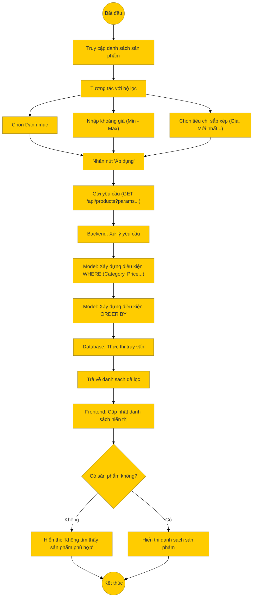

# Sơ đồ hoạt động: Lọc & Sắp xếp sản phẩm (Khách hàng)

## Mô tả chi tiết

1.  **Tương tác**: Tại trang danh sách sản phẩm, người dùng sử dụng thanh bên (sidebar) hoặc menu để lọc.
    *   **Danh mục**: Chọn danh mục cụ thể (Ví dụ: Điện thoại, Laptop).
    *   **Giá**: Nhập khoảng giá mong muốn (Ví dụ: 5tr - 10tr).
    *   **Sắp xếp**: Chọn thứ tự hiển thị (Giá tăng dần, Giá giảm dần, Mới nhất).
2.  **Gửi yêu cầu**: Frontend tổng hợp các tham số và gửi request `GET` đến `/api/products`.
    *   Ví dụ: `/api/products?category_id=1&minPrice=5000000&maxPrice=10000000&sortBy=price&sortOrder=ASC`.
3.  **Xử lý Backend**:
    *   Controller nhận các tham số query.
    *   Model xây dựng câu lệnh SQL động:
        *   Thêm điều kiện `WHERE category_id = ?`.
        *   Thêm điều kiện giá (nếu có logic xử lý giá biến thể).
        *   Thêm mệnh đề `ORDER BY` tương ứng.
4.  **Kết quả**: Trả về danh sách sản phẩm thỏa mãn tất cả các điều kiện lọc.
