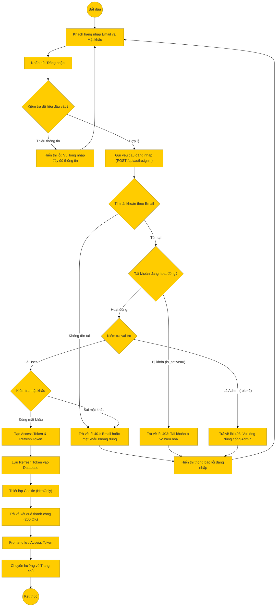

# Sơ đồ hoạt động: Đăng nhập (Khách hàng)

## Mô tả chi tiết

1.  **Bắt đầu**: Người dùng truy cập trang đăng nhập.
2.  **Nhập thông tin**: Người dùng điền Email và Mật khẩu.
3.  **Kiểm tra Frontend**: Hệ thống kiểm tra sơ bộ (không để trống).
4.  **Gửi yêu cầu**: Frontend gọi API đăng nhập.
5.  **Xử lý Backend**:
    *   Kiểm tra sự tồn tại của Email.
    *   Kiểm tra trạng thái hoạt động của tài khoản.
    *   Kiểm tra vai trò (Admin không được đăng nhập ở trang User).
    *   So khớp mật khẩu (đã mã hóa).
6.  **Thành công**:
    *   Hệ thống tạo cặp Token (Access & Refresh).
    *   Lưu Refresh Token vào DB để quản lý phiên.
    *   Gửi Refresh Token về Client qua Cookie bảo mật.
    *   Trả về Access Token và thông tin User.
7.  **Kết thúc**: Frontend lưu Access Token và chuyển hướng người dùng.
