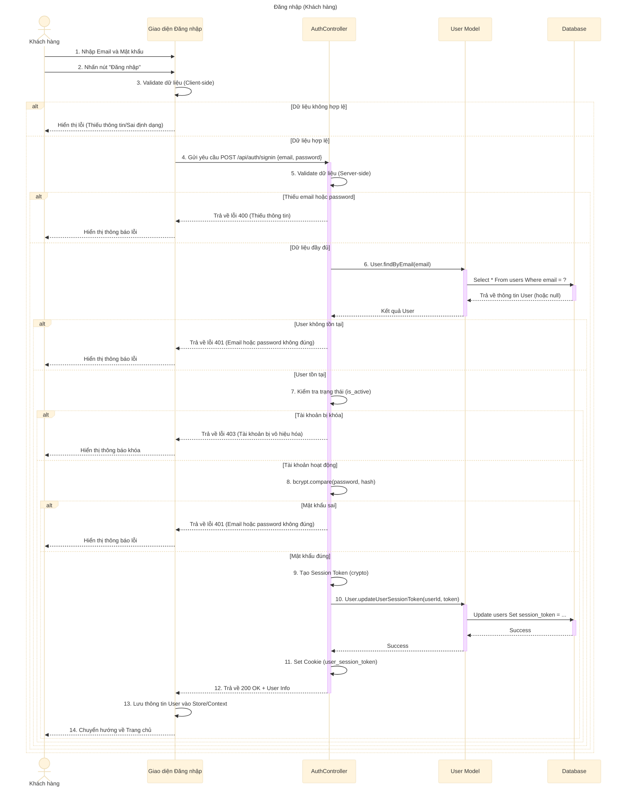

# Sơ đồ tuần tự: Đăng nhập (Khách hàng)

## Mô tả chi tiết các bước

1.  **Khách hàng** nhập thông tin đăng nhập (Email, Password) trên giao diện.
2.  **Giao diện** kiểm tra sơ bộ (validate) định dạng email và độ dài mật khẩu.
3.  Nếu hợp lệ, **Giao diện** gửi request `POST` đến API `signIn`.
4.  **AuthController** nhận request và kiểm tra dữ liệu đầu vào.
5.  **AuthController** gọi **User Model** để tìm kiếm user theo email trong **Database**.
6.  Nếu tìm thấy user:
    *   Kiểm tra trạng thái hoạt động (`is_active`).
    *   So sánh mật khẩu nhập vào với mật khẩu đã mã hóa (hash) trong DB bằng `bcrypt`.
7.  Nếu thông tin chính xác:
    *   Tạo `sessionToken` mới.
    *   Cập nhật token vào Database.
    *   Thiết lập Cookie `user_session_token` cho trình duyệt.
    *   Trả về thông tin user (không bao gồm mật khẩu).
8.  **Giao diện** nhận phản hồi thành công, lưu trạng thái đăng nhập và chuyển hướng người dùng.
