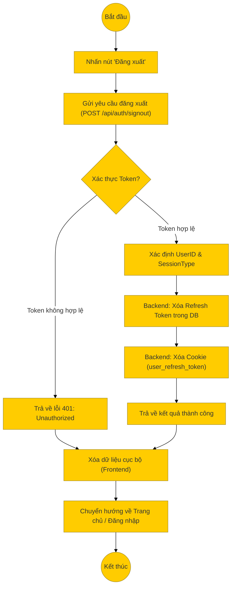

# Sơ đồ hoạt động: Đăng xuất (Khách hàng)

## Mô tả chi tiết

1.  **Bắt đầu**: Người dùng nhấn nút "Đăng xuất" trên thanh điều hướng hoặc menu tài khoản.
2.  **Gửi yêu cầu**: Frontend gửi request `POST` đến `/api/auth/signout`. Request này thường kèm theo Access Token trong Header hoặc Cookie.
3.  **Xử lý Backend**:
    *   **Middleware**: Kiểm tra tính hợp lệ của Access Token hiện tại để xác định người dùng đang thực hiện yêu cầu.
    *   **Controller (`signOut`)**:
        *   Xác định loại phiên làm việc (`sessionType` là 'user').
        *   Gọi `User.clearUserRefreshToken(userId)` để xóa token khỏi cơ sở dữ liệu, ngăn chặn việc sử dụng lại Refresh Token.
        *   Xóa Cookie `user_refresh_token` trên trình duyệt của người dùng.
        *   Trả về phản hồi thành công.
4.  **Xử lý Frontend**:
    *   Nhận phản hồi từ Server.
    *   Xóa các thông tin lưu trữ cục bộ (như Access Token trong `localStorage` hoặc state của ứng dụng).
    *   Chuyển hướng người dùng về trang chủ hoặc trang đăng nhập.
