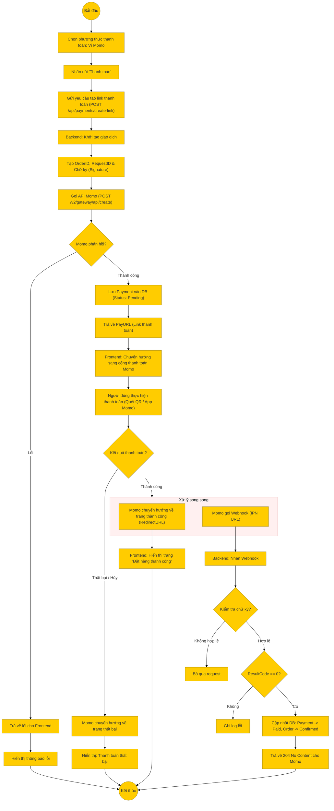

# Sơ đồ hoạt động: Thanh toán qua ví Momo (Khách hàng)

## Mô tả chi tiết

1.  **Khởi tạo**: Khách hàng chọn Momo và nhấn thanh toán.
2.  **Tạo Link**:
    *   Backend tạo chữ ký bảo mật (HMAC SHA256).
    *   Gọi API của Momo để lấy đường dẫn thanh toán (`payUrl`).
    *   Lưu trạng thái thanh toán "Pending" vào cơ sở dữ liệu.
3.  **Thanh toán**:
    *   Người dùng được chuyển hướng sang trang của Momo.
    *   Thực hiện quét mã QR hoặc xác nhận trên ứng dụng Momo.
4.  **Xử lý kết quả (Song song)**:
    *   **Luồng người dùng**: Momo chuyển hướng người dùng quay lại website (Redirect URL). Frontend hiển thị thông báo thành công.
    *   **Luồng hệ thống (IPN)**: Momo gọi API ngầm (Webhook) đến Backend để thông báo kết quả chính thức.
        *   Backend kiểm tra chữ ký để đảm bảo tính toàn vẹn.
        *   Nếu thành công (`resultCode = 0`), cập nhật trạng thái đơn hàng và thanh toán trong Database.
