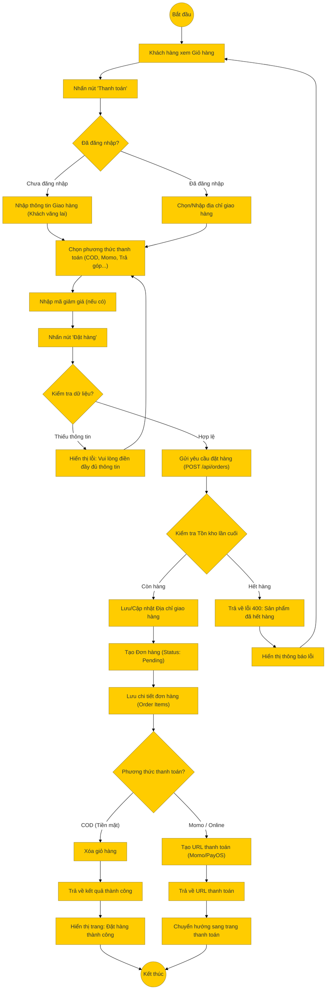

# Sơ đồ hoạt động: Đặt hàng (Khách hàng)

## Mô tả chi tiết

1.  **Bắt đầu**: Khách hàng từ giỏ hàng tiến hành thanh toán.
2.  **Thông tin giao hàng**:
    *   Nếu chưa đăng nhập: Nhập họ tên, SĐT, địa chỉ.
    *   Nếu đã đăng nhập: Chọn từ sổ địa chỉ hoặc thêm mới.
3.  **Thanh toán & Khuyến mãi**: Chọn phương thức thanh toán và áp dụng mã giảm giá.
4.  **Gửi yêu cầu**: Frontend gọi API `POST /api/orders`.
5.  **Xử lý Backend**:
    *   **Kiểm tra tồn kho**: Đảm bảo sản phẩm vẫn còn hàng tại thời điểm đặt.
    *   **Lưu địa chỉ**: Nếu là địa chỉ mới, lưu vào bảng `addresses`.
    *   **Tạo đơn hàng**: Lưu vào bảng `orders` và `order_items`.
    *   **Xử lý thanh toán**:
        *   Nếu là COD: Hoàn tất đơn hàng ngay.
        *   Nếu là Online (Momo/PayOS): Tạo URL thanh toán và trả về cho Frontend để chuyển hướng.
6.  **Kết thúc**:
    *   COD: Hiển thị trang "Cảm ơn".
    *   Online: Chuyển hướng sang cổng thanh toán.
