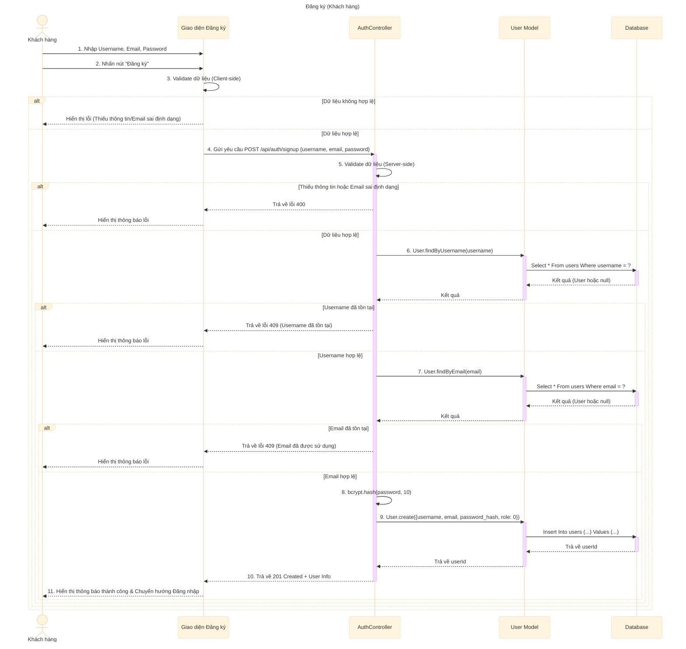

# Sơ đồ tuần tự: Đăng ký (Khách hàng)

## Mô tả chi tiết các bước

1.  **Khách hàng** nhập thông tin đăng ký (Username, Email, Password) trên giao diện Đăng ký.
2.  **Giao diện** kiểm tra sơ bộ (validate) dữ liệu đầu vào (định dạng email, độ dài mật khẩu...).
3.  Nếu hợp lệ, **Giao diện** gửi request `POST` đến API `signUp`.
4.  **AuthController** nhận request và kiểm tra dữ liệu đầu vào (Server-side validation).
5.  **AuthController** gọi **User Model** để kiểm tra sự tồn tại của `username`.
6.  Nếu `username` đã tồn tại, trả về lỗi 409.
7.  Nếu `username` chưa tồn tại, tiếp tục kiểm tra sự tồn tại của `email`.
8.  Nếu `email` đã tồn tại, trả về lỗi 409.
9.  Nếu cả `username` và `email` đều hợp lệ:
    *   Mã hóa mật khẩu bằng `bcrypt`.
    *   Gọi **User Model** để tạo user mới với vai trò là Khách hàng (`role: 0`).
10. **AuthController** trả về phản hồi thành công (201 Created) kèm thông tin user vừa tạo.
11. **Giao diện** hiển thị thông báo thành công và chuyển hướng người dùng sang trang Đăng nhập.
