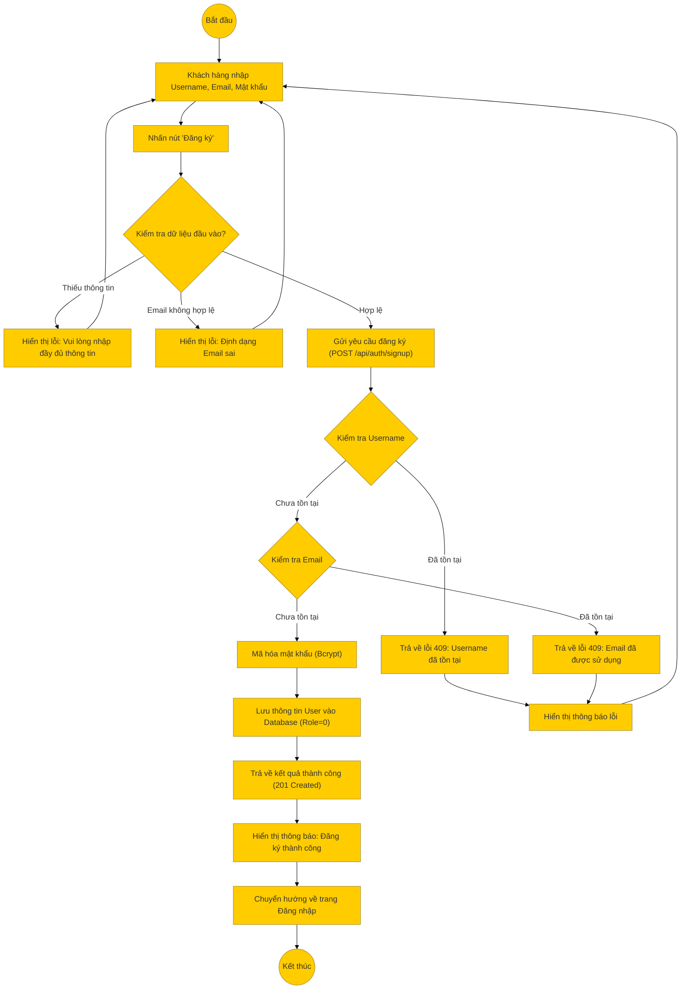

# Sơ đồ hoạt động: Đăng ký (Khách hàng)

## Mô tả chi tiết

1.  **Bắt đầu**: Người dùng truy cập trang đăng ký tài khoản.
2.  **Nhập thông tin**: Người dùng điền Username, Email và Mật khẩu.
3.  **Kiểm tra Frontend**:
    *   Kiểm tra các trường bắt buộc.
    *   Kiểm tra định dạng Email (Regex).
    *   Kiểm tra độ mạnh mật khẩu (nếu có).
4.  **Gửi yêu cầu**: Frontend gọi API `POST /api/auth/signup`.
5.  **Xử lý Backend**:
    *   **Kiểm tra Username**: Truy vấn DB xem username đã có người dùng chưa. Nếu có, trả về lỗi 409.
    *   **Kiểm tra Email**: Truy vấn DB xem email đã có người dùng chưa. Nếu có, trả về lỗi 409.
    *   **Mã hóa mật khẩu**: Sử dụng Bcrypt để hash mật khẩu với salt rounds = 10.
    *   **Tạo User**: Lưu bản ghi mới vào bảng `users` với `role = 0` (Khách hàng).
6.  **Thành công**:
    *   Backend trả về mã 201 và thông tin user vừa tạo (không bao gồm mật khẩu).
7.  **Kết thúc**: Frontend hiển thị thông báo thành công và chuyển hướng người dùng sang trang Đăng nhập để họ thực hiện đăng nhập lần đầu.
