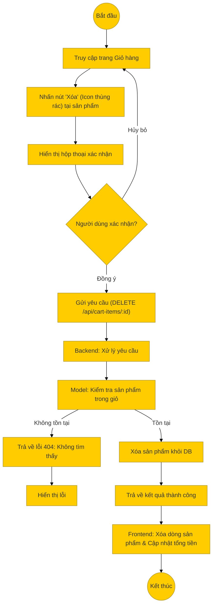

# Sơ đồ hoạt động: Xóa sản phẩm khỏi giỏ hàng (Khách hàng)

## Mô tả chi tiết

1.  **Thao tác**: Tại trang giỏ hàng, người dùng nhấn nút xóa (thường là biểu tượng thùng rác) tương ứng với sản phẩm muốn bỏ.
2.  **Xác nhận**: Hệ thống hiển thị hộp thoại xác nhận để tránh thao tác nhầm.
3.  **Gửi yêu cầu**: Nếu người dùng đồng ý, Frontend gửi request `DELETE` đến `/api/cart-items/:id`.
4.  **Xử lý Backend**:
    *   Controller nhận ID của item trong giỏ hàng.
    *   Model thực hiện lệnh `DELETE` trong bảng `cart_items`.
5.  **Kết quả**:
    *   Backend trả về thông báo thành công.
    *   Frontend xóa dòng sản phẩm đó khỏi giao diện và tính toán lại tổng tiền của giỏ hàng ngay lập tức.
