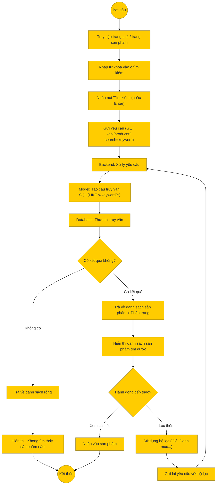

# Sơ đồ hoạt động: Tìm kiếm sản phẩm (Khách hàng)

## Mô tả chi tiết

1.  **Nhập liệu**: Khách hàng nhập từ khóa (tên sản phẩm, mã sản phẩm...) vào thanh tìm kiếm.
2.  **Gửi yêu cầu**: Frontend gửi request `GET` đến `/api/products` với tham số `search`.
3.  **Xử lý Backend**:
    *   Controller nhận tham số `search`.
    *   Model xây dựng câu lệnh SQL sử dụng `LIKE` để tìm kiếm trong tên sản phẩm (`product_name`) hoặc đường dẫn (`slug`).
    *   Truy vấn cơ sở dữ liệu.
4.  **Kết quả**:
    *   Nếu tìm thấy: Trả về danh sách sản phẩm và thông tin phân trang.
    *   Nếu không tìm thấy: Trả về danh sách rỗng.
5.  **Hiển thị**: Frontend hiển thị kết quả hoặc thông báo không tìm thấy. Người dùng có thể tiếp tục lọc kết quả tìm kiếm.
