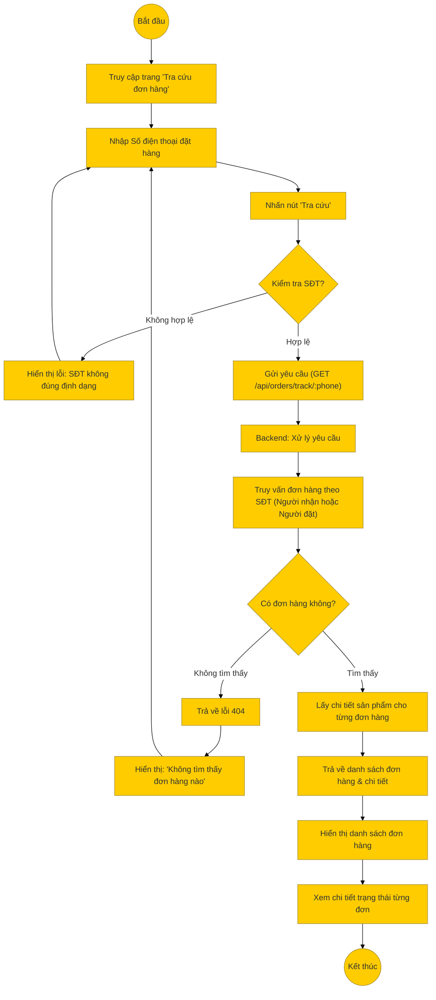

# Sơ đồ hoạt động: Tra cứu đơn hàng (Khách hàng / Khách vãng lai)

## Mô tả chi tiết

1.  **Mục đích**: Cho phép khách hàng (kể cả khách vãng lai chưa đăng nhập) kiểm tra tình trạng đơn hàng thông qua số điện thoại đã dùng để đặt hàng.
2.  **Nhập liệu**: Người dùng nhập số điện thoại vào ô tra cứu.
3.  **Gửi yêu cầu**: Frontend gửi request `GET` đến `/api/orders/track/:phone`.
4.  **Xử lý Backend**:
    *   Truy vấn bảng `orders` kết hợp với `addresses` và `users`.
    *   Điều kiện tìm kiếm: Số điện thoại trong bảng `addresses` (người nhận) HOẶC số điện thoại trong bảng `users` (người đặt) trùng khớp.
    *   Lấy thêm thông tin chi tiết sản phẩm (`order_items`) cho mỗi đơn hàng tìm được.
5.  **Kết quả**:
    *   Trả về danh sách các đơn hàng gắn liền với số điện thoại đó.
    *   Frontend hiển thị thông tin: Mã đơn, Ngày đặt, Tổng tiền, Trạng thái hiện tại (Chờ xử lý, Đang giao, v.v.).
