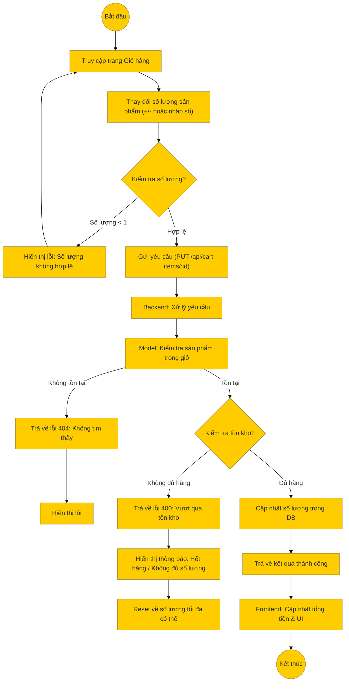

# Sơ đồ hoạt động: Cập nhật giỏ hàng (Khách hàng)

## Mô tả chi tiết

1.  **Thao tác**: Tại trang giỏ hàng, người dùng tăng/giảm số lượng hoặc nhập số lượng mới cho một sản phẩm.
2.  **Gửi yêu cầu**: Frontend gửi request `PUT` đến `/api/cart-items/:id` với `quantity` mới.
3.  **Xử lý Backend**:
    *   **Kiểm tra**: Xác định sản phẩm trong giỏ hàng (`cart_item_id`).
    *   **Tồn kho**: So sánh số lượng yêu cầu với `stock_quantity` trong bảng `product_variants`.
    *   **Cập nhật**: Nếu đủ hàng, cập nhật `quantity` trong bảng `cart_items`.
4.  **Kết quả**:
    *   Thành công: Trả về thông báo và Frontend cập nhật lại tổng tiền.
    *   Thất bại (Hết hàng): Thông báo lỗi và không cập nhật.
