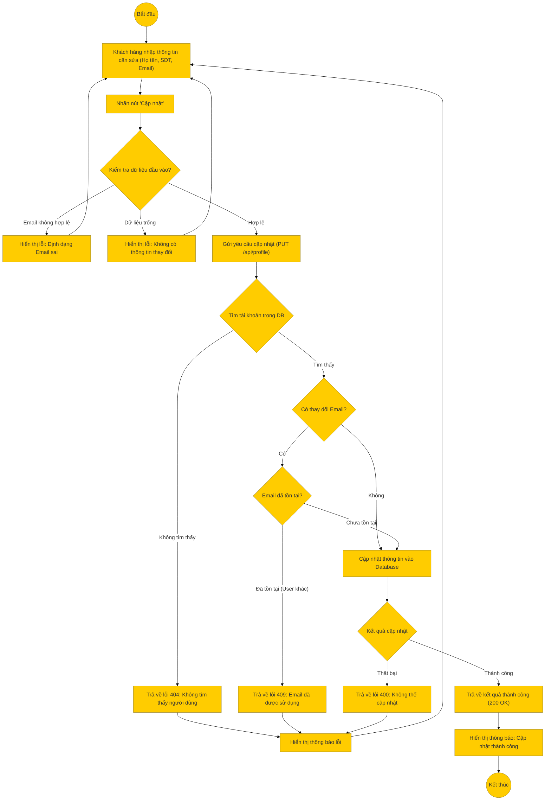

# Sơ đồ hoạt động: Cập nhật thông tin cá nhân (Khách hàng)

## Mô tả chi tiết

1.  **Bắt đầu**: Người dùng truy cập trang Hồ sơ cá nhân (Profile).
2.  **Nhập thông tin**: Người dùng chỉnh sửa các trường thông tin như Họ tên, Số điện thoại, hoặc Email.
3.  **Kiểm tra Frontend**:
    *   Kiểm tra định dạng Email (nếu có thay đổi).
    *   Kiểm tra xem có dữ liệu nào thực sự thay đổi hay không.
4.  **Gửi yêu cầu**: Frontend gọi API `PUT /api/profile`.
5.  **Xử lý Backend**:
    *   Lấy ID người dùng từ Token xác thực.
    *   **Kiểm tra Email**: Nếu người dùng thay đổi email, hệ thống kiểm tra xem email mới đã được sử dụng bởi tài khoản khác chưa. Nếu rồi, trả về lỗi 409.
    *   **Cập nhật**: Thực hiện cập nhật các trường thông tin hợp lệ vào Database.
6.  **Thành công**: Trả về thông tin user mới nhất sau khi cập nhật.
7.  **Kết thúc**: Frontend hiển thị thông báo thành công và cập nhật lại giao diện hiển thị thông tin.
