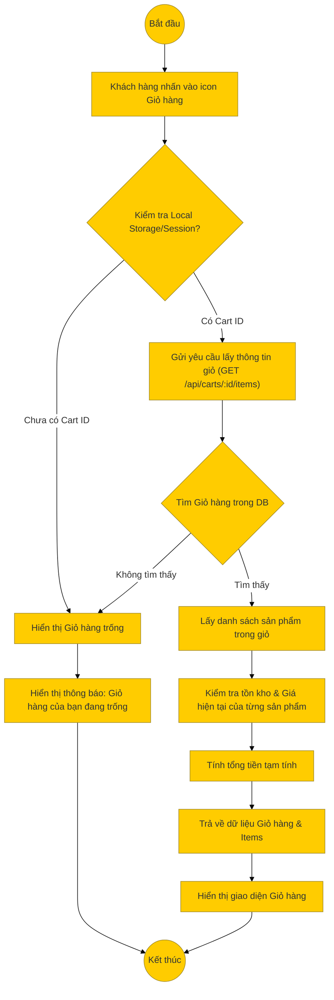

# Sơ đồ hoạt động: Xem giỏ hàng (Khách hàng)

## Mô tả chi tiết

1.  **Bắt đầu**: Khách hàng nhấn vào biểu tượng giỏ hàng trên header hoặc truy cập trang `/cart`.
2.  **Kiểm tra Client**: Frontend kiểm tra xem đã lưu `cartId` trong Local Storage hoặc Session chưa.
    *   Nếu chưa có, hiển thị giỏ hàng trống ngay lập tức.
3.  **Gửi yêu cầu**: Nếu có ID, Frontend gọi API `GET /api/carts/:id/items`.
4.  **Xử lý Backend**:
    *   **Tìm giỏ hàng**: Truy vấn DB theo ID.
    *   **Lấy chi tiết**: Join với bảng `cart_items`, `product_variants`, `products` để lấy thông tin chi tiết (Tên, Hình ảnh, Giá, Tồn kho...).
    *   **Tính toán**: Tính tổng tiền (Subtotal).
5.  **Phản hồi**: Trả về JSON chứa thông tin giỏ hàng và danh sách sản phẩm.
6.  **Hiển thị**: Frontend render danh sách sản phẩm. Nếu có sản phẩm nào hết hàng hoặc thay đổi giá, có thể hiển thị cảnh báo (tùy logic frontend).
