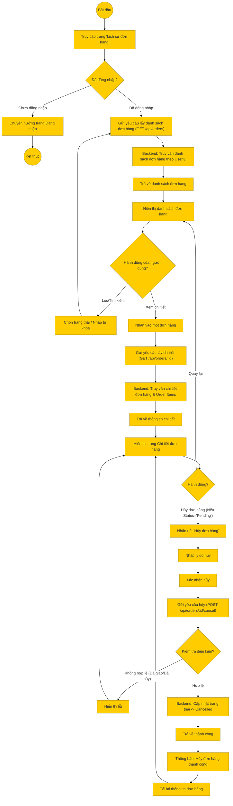

# Sơ đồ hoạt động: Xem lịch sử đơn hàng (Khách hàng)

## Mô tả chi tiết

1.  **Truy cập**: Khách hàng truy cập vào mục "Lịch sử đơn hàng" hoặc "Đơn hàng của tôi".
2.  **Xác thực**: Hệ thống kiểm tra trạng thái đăng nhập. Nếu chưa đăng nhập, chuyển hướng sang trang đăng nhập.
3.  **Lấy danh sách**:
    *   Frontend gọi API `GET /api/orders` kèm theo `userId`.
    *   Backend truy vấn cơ sở dữ liệu và trả về danh sách các đơn hàng của người dùng, bao gồm các thông tin tóm tắt (Mã đơn, Ngày đặt, Tổng tiền, Trạng thái).
4.  **Tương tác danh sách**:
    *   **Lọc/Tìm kiếm**: Người dùng có thể lọc theo trạng thái (Chờ xử lý, Đang giao, Hoàn thành...) hoặc tìm kiếm theo mã đơn hàng.
    *   **Xem chi tiết**: Người dùng nhấn vào một đơn hàng cụ thể để xem chi tiết.
5.  **Xem chi tiết**:
    *   Frontend gọi API `GET /api/orders/:id`.
    *   Backend trả về đầy đủ thông tin: Địa chỉ giao hàng, Danh sách sản phẩm (Order Items), Thông tin thanh toán, Lịch sử trạng thái.
6.  **Hủy đơn hàng**:
    *   Nếu đơn hàng đang ở trạng thái **Pending (Chờ xử lý)**, người dùng có thể thực hiện hủy.
    *   Người dùng nhập lý do và xác nhận.
    *   Frontend gọi API `POST /api/orders/:id/cancel`.
    *   Backend kiểm tra lại trạng thái đơn hàng. Nếu hợp lệ, cập nhật trạng thái sang **Cancelled** và lưu lý do hủy.
