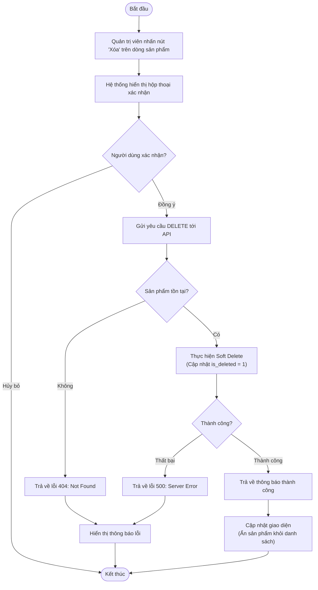

# Activity Diagram: Xóa Sản Phẩm (Delete Product)

## Mô tả
Sơ đồ hoạt động này mô tả quy trình nghiệp vụ khi Quản trị viên thực hiện xóa một sản phẩm. Quy trình bao gồm các bước xác nhận từ phía người dùng và xử lý xóa mềm (soft delete) ở phía máy chủ.

