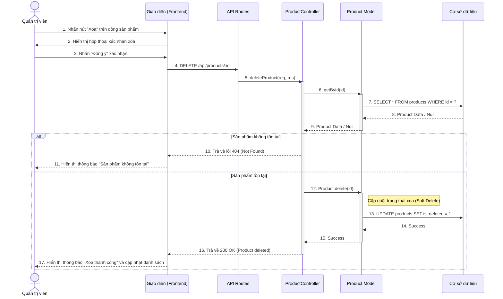

# Sequence Diagram: Xóa Sản Phẩm (Delete Product)

## Mô tả
Sơ đồ tuần tự này mô tả quá trình Quản trị viên (Admin) xóa một sản phẩm khỏi hệ thống. Dựa trên mã nguồn, đây là tính năng **Xóa mềm (Soft Delete)**, nghĩa là dữ liệu không bị xóa vĩnh viễn khỏi cơ sở dữ liệu mà chỉ được đánh dấu là đã xóa (hoặc ẩn đi).

