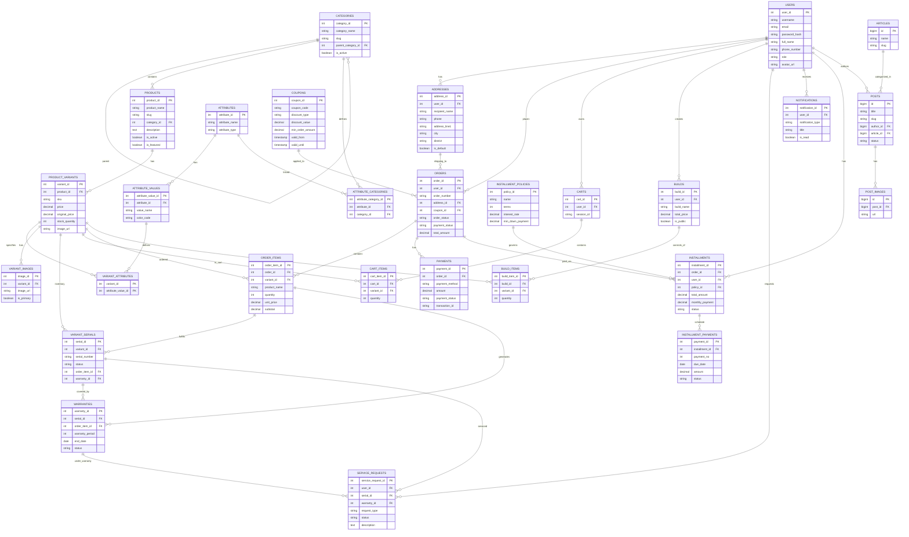

```mermaid
erDiagram
    USERS {
        int user_id PK
        string username
        string email
        string password_hash
        string full_name
        string phone_number
        string role
        string avatar_url
    }

    ADDRESSES {
        int address_id PK
        int user_id FK
        string recipient_name
        string phone
        string address_line1
        string city
        string district
        boolean is_default
    }

    CATEGORIES {
        int category_id PK
        string category_name
        string slug
        int parent_category_id FK
        boolean is_active
    }

    PRODUCTS {
        int product_id PK
        string product_name
        string slug
        int category_id FK
        text description
        boolean is_active
        boolean is_featured
    }

    PRODUCT_VARIANTS {
        int variant_id PK
        int product_id FK
        string sku
        decimal price
        decimal original_price
        int stock_quantity
        string image_url
    }

    ATTRIBUTES {
        int attribute_id PK
        string attribute_name
        string attribute_type
    }

    ATTRIBUTE_VALUES {
        int attribute_value_id PK
        int attribute_id FK
        string value_name
        string color_code
    }

    ATTRIBUTE_CATEGORIES {
        int attribute_category_id PK
        int attribute_id FK
        int category_id FK
    }

    VARIANT_ATTRIBUTES {
        int variant_id PK
        int attribute_value_id PK
    }

    VARIANT_IMAGES {
        int image_id PK
        int variant_id FK
        string image_url
        boolean is_primary
    }

    VARIANT_SERIALS {
        int serial_id PK
        int variant_id FK
        string serial_number
        string status
        int order_item_id FK
        int warranty_id FK
    }

    CARTS {
        int cart_id PK
        int user_id FK
        string session_id
    }

    CART_ITEMS {
        int cart_item_id PK
        int cart_id FK
        int variant_id FK
        int quantity
    }

    COUPONS {
        int coupon_id PK
        string coupon_code
        string discount_type
        decimal discount_value
        decimal min_order_amount
        timestamp valid_from
        timestamp valid_until
    }

    ORDERS {
        int order_id PK
        int user_id FK
        string order_number
        int address_id FK
        int coupon_id FK
        string order_status
        string payment_status
        decimal total_amount
    }

    ORDER_ITEMS {
        int order_item_id PK
        int order_id FK
        int variant_id FK
        string product_name
        int quantity
        decimal unit_price
        decimal subtotal
    }

    PAYMENTS {
        int payment_id PK
        int order_id FK
        string payment_method
        decimal amount
        string payment_status
        string transaction_id
    }

    INSTALLMENT_POLICIES {
        int policy_id PK
        string name
        int terms
        decimal interest_rate
        decimal min_down_payment
    }

    INSTALLMENTS {
        int installment_id PK
        int order_id FK
        int user_id FK
        int policy_id FK
        decimal total_amount
        decimal monthly_payment
        string status
    }

    INSTALLMENT_PAYMENTS {
        int payment_id PK
        int installment_id FK
        int payment_no
        date due_date
        decimal amount
        string status
    }

    WARRANTIES {
        int warranty_id PK
        int serial_id FK
        int order_item_id FK
        int warranty_period
        date end_date
        string status
    }

    SERVICE_REQUESTS {
        int service_request_id PK
        int user_id FK
        int serial_id FK
        int warranty_id FK
        string request_type
        string status
        text description
    }

    BUILDS {
        int build_id PK
        int user_id FK
        string build_name
        decimal total_price
        boolean is_public
    }

    BUILD_ITEMS {
        int build_item_id PK
        int build_id FK
        int variant_id FK
        int quantity
    }

    ARTICLES {
        bigint id PK
        string name
        string slug
    }

    POSTS {
        bigint id PK
        string title
        string slug
        bigint author_id FK
        bigint article_id FK
        string status
    }

    POST_IMAGES {
        bigint id PK
        bigint post_id FK
        string url
    }

    NOTIFICATIONS {
        int notification_id PK
        int user_id FK
        string notification_type
        string title
        boolean is_read
    }

    USERS ||--o{ ADDRESSES : has
    USERS ||--o{ ORDERS : places
    USERS ||--o{ CARTS : owns
    USERS ||--o{ BUILDS : creates
    USERS ||--o{ SERVICE_REQUESTS : requests
    USERS ||--o{ NOTIFICATIONS : receives
    USERS ||--o{ INSTALLMENTS : has
    USERS ||--o{ POSTS : authors

    CATEGORIES ||--o{ CATEGORIES : parent
    CATEGORIES ||--o{ PRODUCTS : contains
    CATEGORIES ||--o{ ATTRIBUTE_CATEGORIES : defines

    PRODUCTS ||--o{ PRODUCT_VARIANTS : has

    ATTRIBUTES ||--o{ ATTRIBUTE_VALUES : has
    ATTRIBUTES ||--o{ ATTRIBUTE_CATEGORIES : linked

    PRODUCT_VARIANTS ||--o{ VARIANT_ATTRIBUTES : specifies
    ATTRIBUTE_VALUES ||--o{ VARIANT_ATTRIBUTES : defines
    PRODUCT_VARIANTS ||--o{ VARIANT_IMAGES : has
    PRODUCT_VARIANTS ||--o{ VARIANT_SERIALS : inventory
    PRODUCT_VARIANTS ||--o{ CART_ITEMS : in_cart
    PRODUCT_VARIANTS ||--o{ ORDER_ITEMS : ordered
    PRODUCT_VARIANTS ||--o{ BUILD_ITEMS : in_build

    CARTS ||--o{ CART_ITEMS : contains

    ORDERS ||--o{ ORDER_ITEMS : contains
    ORDERS ||--o{ PAYMENTS : has
    ORDERS ||--o{ INSTALLMENTS : paid_via
    ADDRESSES ||--o{ ORDERS : shipping_to
    COUPONS ||--o{ ORDERS : applied_to

    INSTALLMENT_POLICIES ||--o{ INSTALLMENTS : governs
    INSTALLMENTS ||--o{ INSTALLMENT_PAYMENTS : schedule

    ORDER_ITEMS ||--o{ VARIANT_SERIALS : fulfills
    ORDER_ITEMS ||--o{ WARRANTIES : generates

    VARIANT_SERIALS ||--o{ WARRANTIES : covered_by
    VARIANT_SERIALS ||--o{ SERVICE_REQUESTS : serviced

    WARRANTIES ||--o{ SERVICE_REQUESTS : under_warranty

    BUILDS ||--o{ BUILD_ITEMS : consists_of

    ARTICLES ||--o{ POSTS : categorized_in
    POSTS ||--o{ POST_IMAGES : has
```
