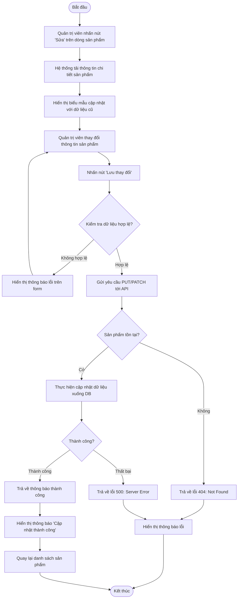

# Activity Diagram: Cập nhật Sản Phẩm (Update Product)

## Mô tả
Sơ đồ hoạt động này mô tả quy trình nghiệp vụ khi Quản trị viên tiến hành chỉnh sửa thông tin của một sản phẩm.

```mermaid
flowchart TD
    Start([Bắt đầu]) --> ClickEdit[Quản trị viên nhấn nút 'Sửa' trên dòng sản phẩm]
    ClickEdit --> FetchData[Hệ thống tải thông tin chi tiết sản phẩm]
    FetchData --> ShowForm[Hiển thị biểu mẫu cập nhật với dữ liệu cũ]
    
    ShowForm --> AdminInput[Quản trị viên thay đổi thông tin sản phẩm]
    AdminInput --> ClickSave[Nhấn nút 'Lưu thay đổi']
    
    ClickSave --> ValidateClient{Kiểm tra dữ liệu hợp lệ?}
    
    ValidateClient -- "Không hợp lệ" --> ShowValError[Hiển thị thông báo lỗi trên form]
    ShowValError --> AdminInput
    
    ValidateClient -- "Hợp lệ" --> SendRequest[Gửi yêu cầu PUT/PATCH tới API]
    
    SendRequest --> CheckExist{Sản phẩm tồn tại?}
    
    CheckExist -- "Không" --> ErrorNotFound[Trả về lỗi 404: Not Found]
    ErrorNotFound --> ShowError[Hiển thị thông báo lỗi] --> End([Kết thúc])
    
    CheckExist -- "Có" --> UpdateDB[Thực hiện cập nhật dữ liệu xuống DB]
    
    UpdateDB --> DBResult{Thành công?}
    
    DBResult -- "Thất bại" --> ServerError[Trả về lỗi 500: Server Error]
    ServerError --> ShowError
    
    DBResult -- "Thành công" --> ReturnSuccess[Trả về thông báo thành công]
    ReturnSuccess --> ShowSuccess[Hiển thị thông báo 'Cập nhật thành công']
    ShowSuccess --> Redirect[Quay lại danh sách sản phẩm]
    Redirect --> End
```
