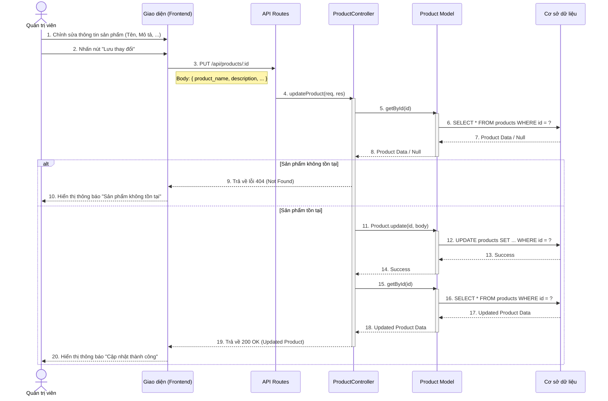

# Sequence Diagram: Cập nhật Sản Phẩm (Update Product)

## Mô tả
Sơ đồ tuần tự này mô tả quá trình Quản trị viên (Admin) cập nhật thông tin chung của một sản phẩm (như Tên, Mô tả, Slug, Trạng thái hiển thị). Lưu ý: Quá trình này không cập nhật thông tin biến thể (Variant), việc quản lý biến thể sẽ có API riêng.

