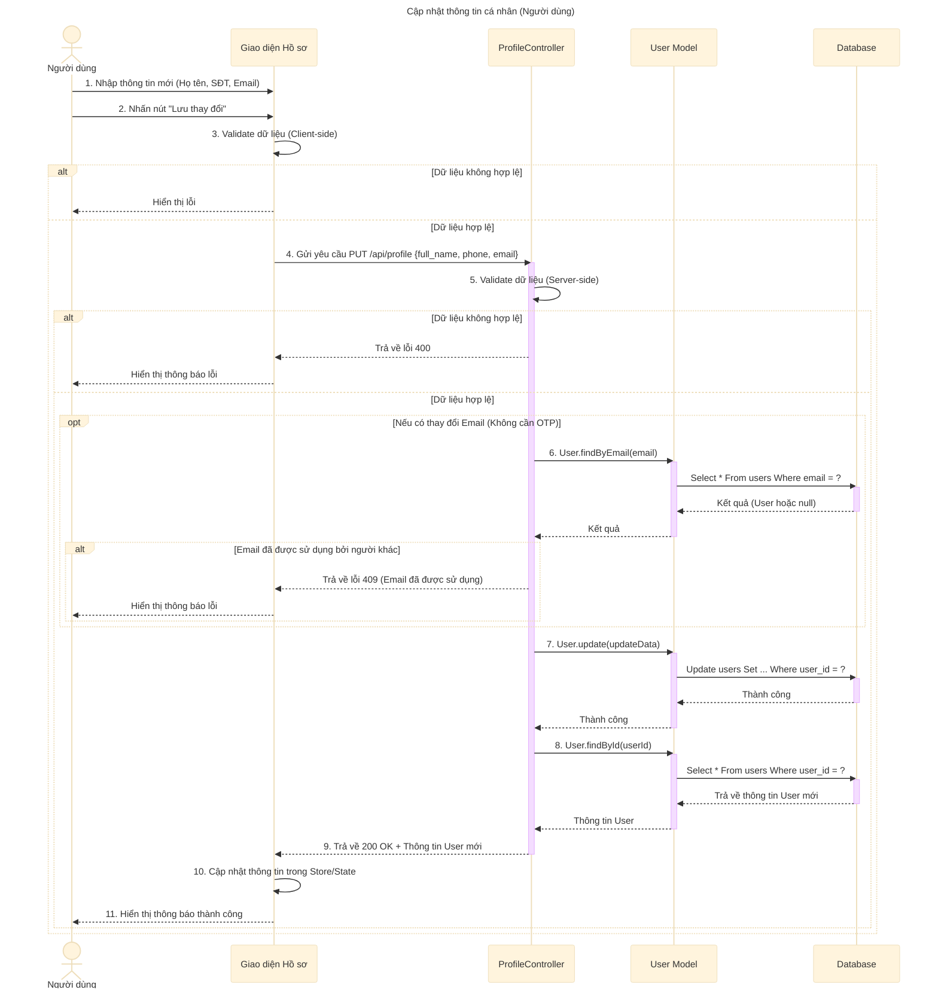

# Sơ đồ tuần tự: Cập nhật thông tin cá nhân (Người dùng)

## Mô tả chi tiết các bước

1.  **Người dùng** (đã đăng nhập) truy cập trang Hồ sơ cá nhân, thay đổi các thông tin như Họ tên, Số điện thoại, Email.
2.  **Giao diện** kiểm tra sơ bộ (validate) dữ liệu.
3.  Nếu dữ liệu hợp lệ, **Giao diện** gửi request `PUT` đến API `updateProfile` (ví dụ: `/api/profile`).
4.  **ProfileController** nhận request và kiểm tra dữ liệu đầu vào.
5.  Nếu người dùng có thay đổi Email (Cập nhật trực tiếp, không cần OTP):
    *   Kiểm tra định dạng email.
    *   Gọi **User Model** để kiểm tra xem email mới đã được sử dụng bởi tài khoản khác chưa.
    *   Nếu đã tồn tại, trả về lỗi 409.
6.  Nếu dữ liệu hợp lệ, gọi **User Model** để cập nhật thông tin vào Database.
7.  Sau khi cập nhật thành công, gọi **User Model** để lấy lại thông tin mới nhất của user.
8.  **ProfileController** trả về phản hồi thành công (200 OK) kèm theo thông tin user đã cập nhật.
9.  **Giao diện** cập nhật lại thông tin hiển thị và thông báo thành công cho người dùng.
