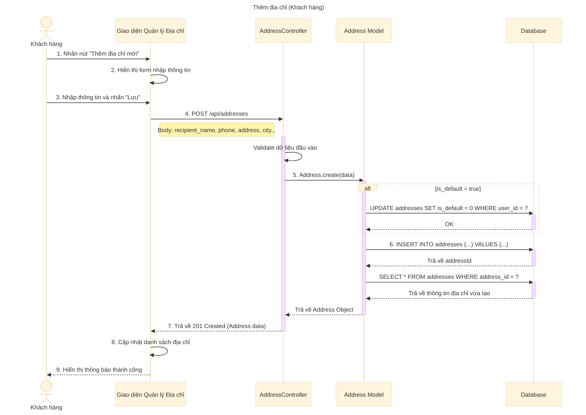

# Sơ đồ tuần tự: Thêm địa chỉ (Khách hàng)

## Mô tả chi tiết các bước

1.  **Khách hàng** truy cập trang quản lý địa chỉ và nhấn nút "Thêm địa chỉ mới".
2.  **Giao diện** hiển thị form để người dùng nhập các thông tin cần thiết (Tên người nhận, SĐT, Địa chỉ, Tỉnh/Thành, Quận/Huyện...).
3.  **Khách hàng** điền thông tin và nhấn nút "Lưu".
4.  **Giao diện** gửi yêu cầu `POST` đến API `/api/addresses` kèm theo dữ liệu JSON.
5.  **AddressController** kiểm tra tính hợp lệ của dữ liệu (các trường bắt buộc).
6.  **AddressController** gọi `Address.create` trong Model.
7.  **Address Model** kiểm tra: Nếu địa chỉ mới được đặt là mặc định (`is_default = true`), hệ thống sẽ cập nhật tất cả địa chỉ cũ của user đó về `is_default = 0` trước.
8.  **Address Model** thực hiện câu lệnh `INSERT` vào bảng `addresses`.
9.  **Address Model** truy vấn lại địa chỉ vừa tạo để lấy đầy đủ thông tin (bao gồm cả `created_at`).
10. **AddressController** trả về kết quả thành công cho Client.
11. **Giao diện** thêm địa chỉ mới vào danh sách hiển thị và thông báo cho người dùng.
