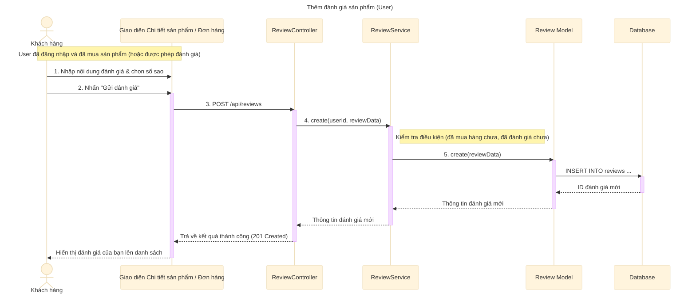

# Sơ đồ tuần tự: Thêm đánh giá sản phẩm (User)

```mermaid
%%{init: {'theme': 'base', 'themeVariables': { 'loopBorder': '#000000'}}}%%
sequenceDiagram
    title: Thêm đánh giá sản phẩm (User)
    actor User as Khách hàng
    participant UI as Giao diện Chi tiết sản phẩm / Đơn hàng
    participant Controller as ReviewController
    participant Service as ReviewService
    participant Model as Review Model
    participant DB as Database

    note over User, UI: User đã đăng nhập và đã mua sản phẩm (hoặc được phép đánh giá)

    User->>UI: 1. Nhập nội dung đánh giá & chọn số sao
    User->>UI: 2. Nhấn "Gửi đánh giá"
    
    activate UI
    UI->>Controller: 3. POST /api/reviews
    activate Controller
    
    Controller->>Service: 4. create(userId, reviewData)
    activate Service
    
    note right of Service: Kiểm tra điều kiện (đã mua hàng chưa, đã đánh giá chưa)
    
    Service->>Model: 5. create(reviewData)
    activate Model
    Model->>DB: INSERT INTO reviews ...
    activate DB
    DB-->>Model: ID đánh giá mới
    deactivate DB
    Model-->>Service: Thông tin đánh giá mới
    deactivate Model
    
    Service-->>Controller: Thông tin đánh giá mới
    deactivate Service
    
    Controller-->>UI: Trả về kết quả thành công (201 Created)
    deactivate Controller
    
    UI-->>User: Hiển thị đánh giá của bạn lên danh sách
    deactivate UI
```