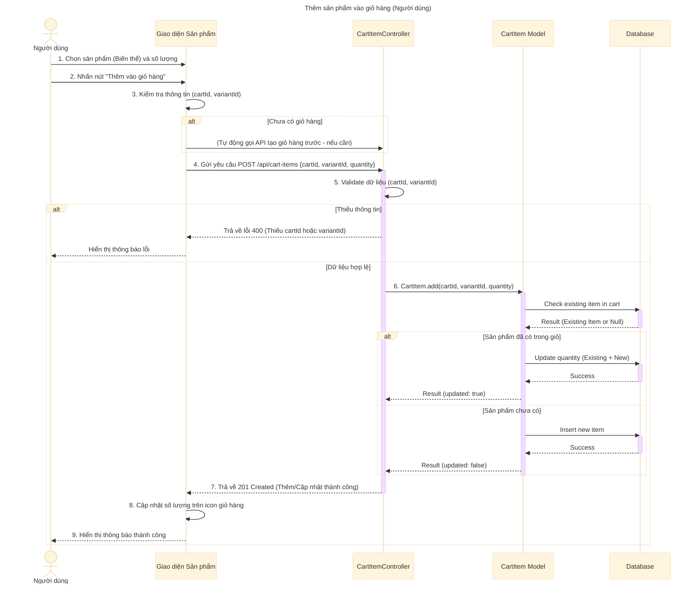

# Sơ đồ tuần tự: Thêm sản phẩm vào giỏ hàng (Người dùng)

## Mô tả chi tiết các bước

1.  **Người dùng** xem chi tiết sản phẩm, chọn biến thể (màu sắc, kích thước...) và số lượng muốn mua.
2.  **Người dùng** nhấn nút "Thêm vào giỏ hàng".
3.  **Giao diện** kiểm tra xem đã có `cartId` (trong LocalStorage hoặc State) chưa. Nếu chưa, có thể cần gọi API tạo giỏ hàng trước (hoặc xử lý ở bước sau).
4.  **Giao diện** gửi request `POST` đến API `addToCart` với `cartId`, `variantId` và `quantity`.
5.  **CartItemController** nhận request và kiểm tra dữ liệu đầu vào.
6.  **CartItemController** gọi **CartItem Model** để thêm sản phẩm.
7.  **CartItem Model** kiểm tra trong Database xem sản phẩm này (`variantId`) đã có trong giỏ hàng (`cartId`) chưa.
    *   Nếu đã có: Cập nhật số lượng (Số lượng cũ + Số lượng mới).
    *   Nếu chưa có: Thêm dòng mới vào bảng `cart_items`.
8.  **CartItemController** trả về phản hồi thành công (201 Created) kèm thông báo tương ứng (Thêm mới hoặc Cập nhật).
9.  **Giao diện** cập nhật số lượng hiển thị trên icon giỏ hàng và hiển thị thông báo "Thêm vào giỏ hàng thành công".
