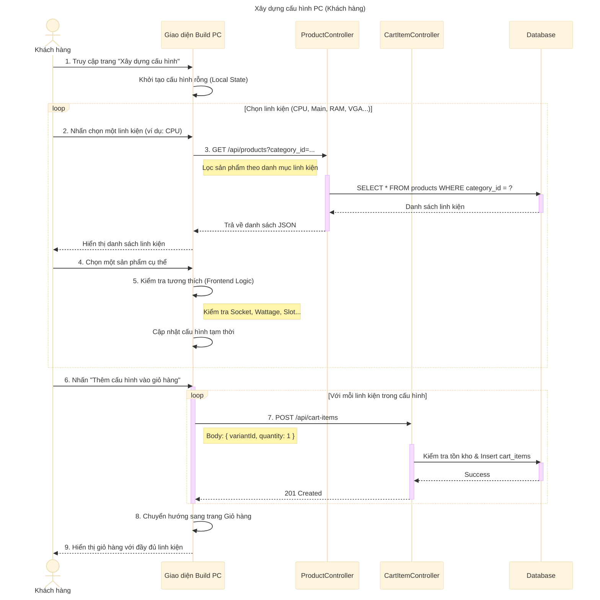

# Sơ đồ tuần tự: Xây dựng cấu hình PC (Khách hàng)

## Mô tả chi tiết các bước

1.  **Khách hàng** truy cập vào trang "Xây dựng cấu hình PC" (Build PC).
2.  **Giao diện** hiển thị danh sách các nhóm linh kiện cần thiết (Vi xử lý, Bo mạch chủ, RAM, Ổ cứng, Card màn hình, Nguồn, Vỏ case...).
3.  **Khách hàng** lần lượt chọn từng nhóm linh kiện.
4.  **Giao diện** gửi yêu cầu `GET` đến `ProductController` để lấy danh sách sản phẩm thuộc danh mục tương ứng (ví dụ: lấy tất cả CPU).
5.  **ProductController** truy vấn Database và trả về danh sách sản phẩm.
6.  **Khách hàng** chọn một sản phẩm cụ thể.
7.  **Giao diện** (Frontend) thực hiện logic kiểm tra tương thích (ví dụ: CPU Socket 1700 phải đi với Mainboard hỗ trợ Socket 1700). *Lưu ý: Logic này thường nằm ở Frontend hoặc một API check riêng, ở đây mô tả xử lý tại Frontend*.
8.  Sau khi chọn đủ các linh kiện, **Khách hàng** nhấn nút "Thêm vào giỏ hàng".
9.  **Giao diện** duyệt qua danh sách các linh kiện đã chọn trong cấu hình tạm thời.
10. Với mỗi linh kiện, **Giao diện** gọi API `POST /api/cart-items` của **CartItemController** để thêm sản phẩm đó vào giỏ hàng của người dùng.
11. Sau khi thêm thành công tất cả, hệ thống chuyển hướng người dùng đến trang Giỏ hàng để tiến hành thanh toán.
