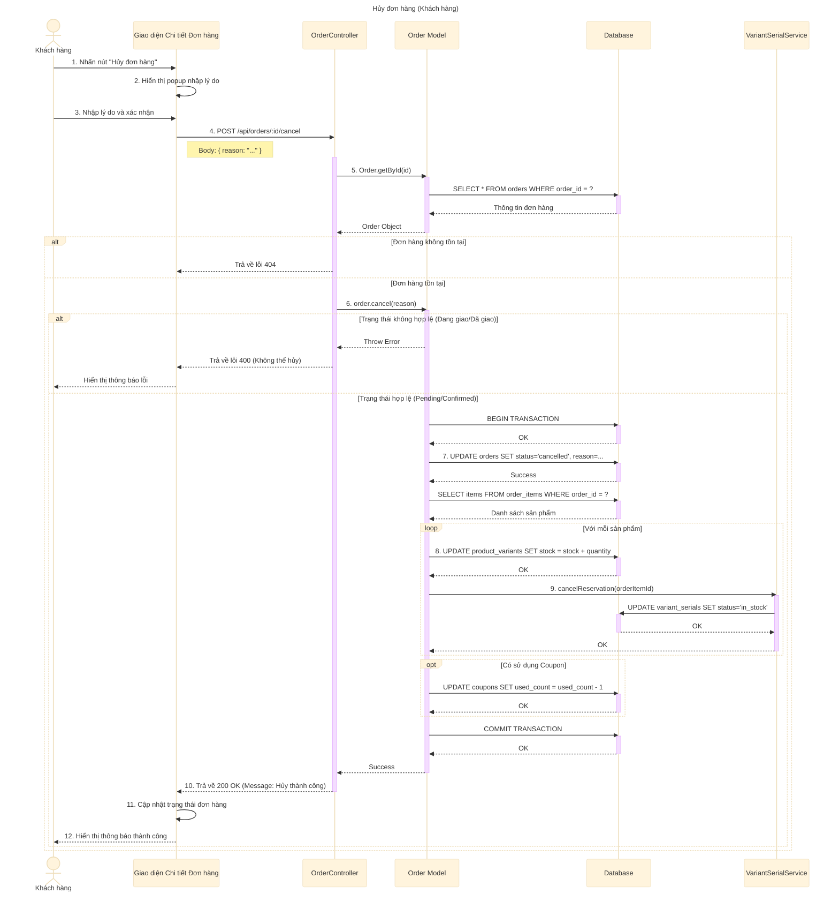

# Sơ đồ tuần tự: Hủy đơn hàng (Khách hàng)

## Mô tả chi tiết các bước

1.  **Khách hàng** nhấn nút "Hủy đơn hàng" trên giao diện chi tiết đơn hàng.
2.  **Giao diện** yêu cầu người dùng nhập lý do hủy.
3.  **Khách hàng** nhập lý do và xác nhận.
4.  **Giao diện** gửi yêu cầu `POST` đến API `/api/orders/:id/cancel`.
5.  **OrderController** lấy thông tin đơn hàng từ Database.
6.  **OrderController** gọi phương thức `cancel` của đối tượng Order.
7.  **Order Model** kiểm tra trạng thái đơn hàng: Chỉ cho phép hủy khi đơn hàng đang ở trạng thái `pending` (chờ xử lý) hoặc `confirmed` (đã xác nhận). Nếu đang giao hàng hoặc đã giao, báo lỗi.
8.  **Order Model** bắt đầu Transaction.
9.  **Order Model** cập nhật trạng thái đơn hàng thành `cancelled` và lưu lý do hủy.
10. **Order Model** hoàn trả số lượng tồn kho cho các sản phẩm trong đơn hàng (`stock_quantity` tăng lên).
11. **Order Model** gọi `VariantSerialService` để giải phóng các mã Serial đã giữ chỗ (chuyển trạng thái từ `reserved` về `in_stock`).
12. Nếu đơn hàng có dùng mã giảm giá, **Order Model** giảm số lượt sử dụng của mã đó (`used_count` giảm đi 1).
13. **Order Model** Commit Transaction.
14. **OrderController** trả về kết quả thành công.
15. **Giao diện** cập nhật trạng thái đơn hàng thành "Đã hủy" và thông báo cho người dùng.
