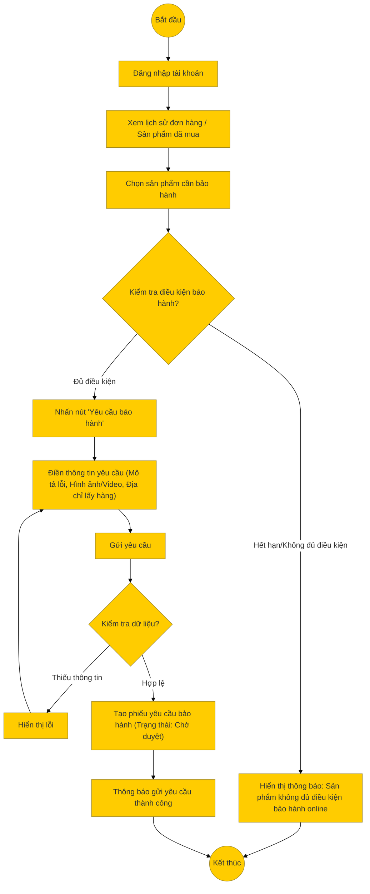

```mermaid
%%{init: {'theme': 'base', 'themeVariables': { 'primaryColor': '#ffcc00', 'edgeLabelBackground':'#ffffff', 'tertiaryColor': '#fff0f0'}}}%%
flowchart TD
    Start((Bắt đầu)) --> Login["Đăng nhập tài khoản"]
    Login --> ViewOrders["Xem lịch sử đơn hàng / Sản phẩm đã mua"]
    ViewOrders --> SelectProduct["Chọn sản phẩm cần bảo hành"]
    
    SelectProduct --> CheckEligible{"Kiểm tra điều kiện bảo hành?"}
    CheckEligible -- "Hết hạn/Không đủ điều kiện" --> ShowIneligible["Hiển thị thông báo: Sản phẩm không đủ điều kiện bảo hành online"]
    ShowIneligible --> End((Kết thúc))
    
    CheckEligible -- "Đủ điều kiện" --> ClickRequest["Nhấn nút 'Yêu cầu bảo hành'"]
    ClickRequest --> FillForm["Điền thông tin yêu cầu (Mô tả lỗi, Hình ảnh/Video, Địa chỉ lấy hàng)"]
    
    FillForm --> Submit["Gửi yêu cầu"]
    Submit --> Validate{"Kiểm tra dữ liệu?"}
    
    Validate -- "Thiếu thông tin" --> ShowError["Hiển thị lỗi"]
    ShowError --> FillForm
    
    Validate -- "Hợp lệ" --> CreateRequest["Tạo phiếu yêu cầu bảo hành (Trạng thái: Chờ duyệt)"]
    CreateRequest --> NotifySuccess["Thông báo gửi yêu cầu thành công"]
    NotifySuccess --> End
```