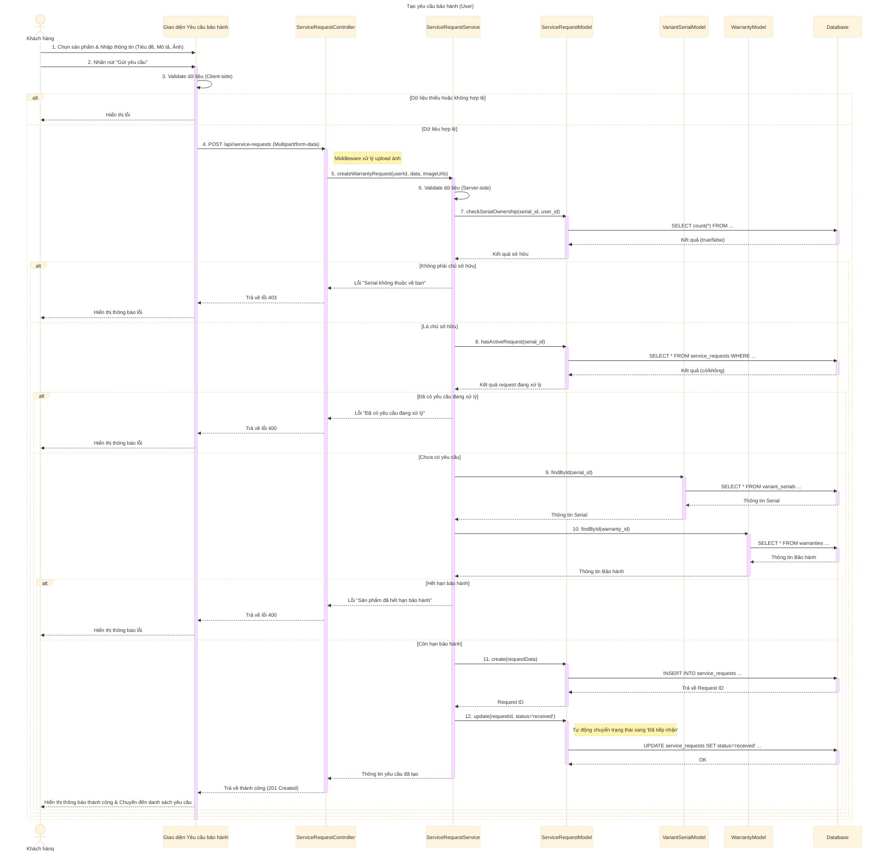

# Sơ đồ tuần tự: Tạo yêu cầu bảo hành (User)

```mermaid
%%{init: {'theme': 'base', 'themeVariables': { 'loopBorder': '#000000'}}}%%
sequenceDiagram
    title: Tạo yêu cầu bảo hành (User)
    actor User as Khách hàng
    participant UI as Giao diện Yêu cầu bảo hành
    participant Controller as ServiceRequestController
    participant Service as ServiceRequestService
    participant RequestModel as ServiceRequestModel
    participant SerialModel as VariantSerialModel
    participant WarrantyModel as WarrantyModel
    participant DB as Database

    User->>UI: 1. Chọn sản phẩm & Nhập thông tin (Tiêu đề, Mô tả, Ảnh)
    User->>UI: 2. Nhấn nút "Gửi yêu cầu"
    
    activate UI
    UI->>UI: 3. Validate dữ liệu (Client-side)
    
    alt Dữ liệu thiếu hoặc không hợp lệ
        UI-->>User: Hiển thị lỗi
    else Dữ liệu hợp lệ
        UI->>Controller: 4. POST /api/service-requests (Multipart/form-data)
        activate Controller
        note right of Controller: Middleware xử lý upload ảnh
        
        Controller->>Service: 5. createWarrantyRequest(userId, data, imageUrls)
        activate Service
        
        Service->>Service: 6. Validate dữ liệu (Server-side)
        
        Service->>RequestModel: 7. checkSerialOwnership(serial_id, user_id)
        activate RequestModel
        RequestModel->>DB: SELECT count(*) FROM ...
        activate DB
        DB-->>RequestModel: Kết quả (true/false)
        deactivate DB
        RequestModel-->>Service: Kết quả sở hữu
        deactivate RequestModel
        
        alt Không phải chủ sở hữu
            Service-->>Controller: Lỗi "Serial không thuộc về bạn"
            Controller-->>UI: Trả về lỗi 403
            UI-->>User: Hiển thị thông báo lỗi
        else Là chủ sở hữu
            Service->>RequestModel: 8. hasActiveRequest(serial_id)
            activate RequestModel
            RequestModel->>DB: SELECT * FROM service_requests WHERE ...
            activate DB
            DB-->>RequestModel: Kết quả (có/không)
            deactivate DB
            RequestModel-->>Service: Kết quả request đang xử lý
            deactivate RequestModel
            
            alt Đã có yêu cầu đang xử lý
                Service-->>Controller: Lỗi "Đã có yêu cầu đang xử lý"
                Controller-->>UI: Trả về lỗi 400
                UI-->>User: Hiển thị thông báo lỗi
            else Chưa có yêu cầu
                Service->>SerialModel: 9. findById(serial_id)
                activate SerialModel
                SerialModel->>DB: SELECT * FROM variant_serials ...
                activate DB
                DB-->>SerialModel: Thông tin Serial
                deactivate DB
                SerialModel-->>Service: Thông tin Serial
                deactivate SerialModel
                
                Service->>WarrantyModel: 10. findById(warranty_id)
                activate WarrantyModel
                WarrantyModel->>DB: SELECT * FROM warranties ...
                activate DB
                DB-->>WarrantyModel: Thông tin Bảo hành
                deactivate DB
                WarrantyModel-->>Service: Thông tin Bảo hành
                deactivate WarrantyModel
                
                alt Hết hạn bảo hành
                    Service-->>Controller: Lỗi "Sản phẩm đã hết hạn bảo hành"
                    Controller-->>UI: Trả về lỗi 400
                    UI-->>User: Hiển thị thông báo lỗi
                else Còn hạn bảo hành
                    Service->>RequestModel: 11. create(requestData)
                    activate RequestModel
                    RequestModel->>DB: INSERT INTO service_requests ...
                    activate DB
                    DB-->>RequestModel: Trả về Request ID
                    deactivate DB
                    RequestModel-->>Service: Request ID
                    deactivate RequestModel
                    
                    Service->>RequestModel: 12. update(requestId, status='received')
                    activate RequestModel
                    note right of RequestModel: Tự động chuyển trạng thái sang 'Đã tiếp nhận'
                    RequestModel->>DB: UPDATE service_requests SET status='received' ...
                    activate DB
                    DB-->>RequestModel: OK
                    deactivate DB
                    deactivate RequestModel
                    
                    Service-->>Controller: Thông tin yêu cầu đã tạo
                    deactivate Service
                    
                    Controller-->>UI: Trả về thành công (201 Created)
                    deactivate Controller
                    
                    UI-->>User: Hiển thị thông báo thành công & Chuyển đến danh sách yêu cầu
                end
            end
        end
    end
    deactivate UI
```
