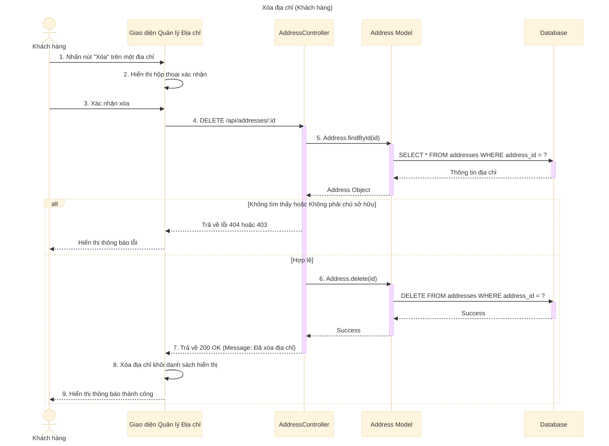

# Sơ đồ tuần tự: Xóa địa chỉ (Khách hàng)

## Mô tả chi tiết các bước

1.  **Khách hàng** nhấn nút "Xóa" tại dòng địa chỉ muốn xóa.
2.  **Giao diện** hiển thị hộp thoại xác nhận (Confirm Dialog) để tránh xóa nhầm.
3.  **Khách hàng** nhấn "Đồng ý" hoặc "Xác nhận".
4.  **Giao diện** gửi yêu cầu `DELETE` đến API `/api/addresses/:id`.
5.  **AddressController** gọi `Address.findById` để lấy thông tin địa chỉ.
    *   Hệ thống kiểm tra xem địa chỉ có tồn tại không.
    *   Hệ thống kiểm tra quyền sở hữu: `address.user_id` phải trùng với `req.user.user_id`.
6.  Nếu hợp lệ, **AddressController** gọi `Address.delete`.
7.  **Address Model** thực hiện câu lệnh `DELETE` trực tiếp trong Database (Xóa cứng).
8.  **AddressController** trả về phản hồi thành công.
9.  **Giao diện** loại bỏ địa chỉ vừa xóa khỏi danh sách và hiển thị thông báo thành công.
