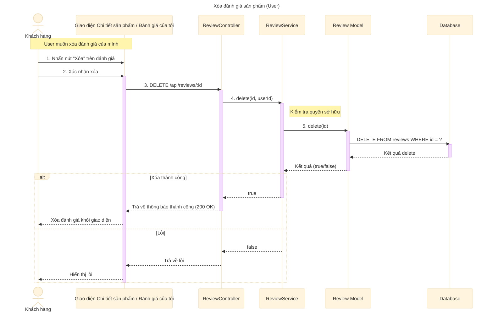

# Sơ đồ tuần tự: Xóa đánh giá sản phẩm (User)

```mermaid
%%{init: {'theme': 'base', 'themeVariables': { 'loopBorder': '#000000'}}}%%
sequenceDiagram
    title: Xóa đánh giá sản phẩm (User)
    actor User as Khách hàng
    participant UI as Giao diện Chi tiết sản phẩm / Đánh giá của tôi
    participant Controller as ReviewController
    participant Service as ReviewService
    participant Model as Review Model
    participant DB as Database

    note over User, UI: User muốn xóa đánh giá của mình

    User->>UI: 1. Nhấn nút "Xóa" trên đánh giá
    User->>UI: 2. Xác nhận xóa
    
    activate UI
    UI->>Controller: 3. DELETE /api/reviews/:id
    activate Controller
    
    Controller->>Service: 4. delete(id, userId)
    activate Service
    
    note right of Service: Kiểm tra quyền sở hữu
    
    Service->>Model: 5. delete(id)
    activate Model
    Model->>DB: DELETE FROM reviews WHERE id = ?
    activate DB
    DB-->>Model: Kết quả delete
    deactivate DB
    Model-->>Service: Kết quả (true/false)
    deactivate Model
    
    alt Xóa thành công
        Service-->>Controller: true
        deactivate Service
        Controller-->>UI: Trả về thông báo thành công (200 OK)
        deactivate Controller
        
        UI-->>User: Xóa đánh giá khỏi giao diện
    else Lỗi
        Service-->>Controller: false
        Controller-->>UI: Trả về lỗi
        UI-->>User: Hiển thị lỗi
    end
    deactivate UI
```