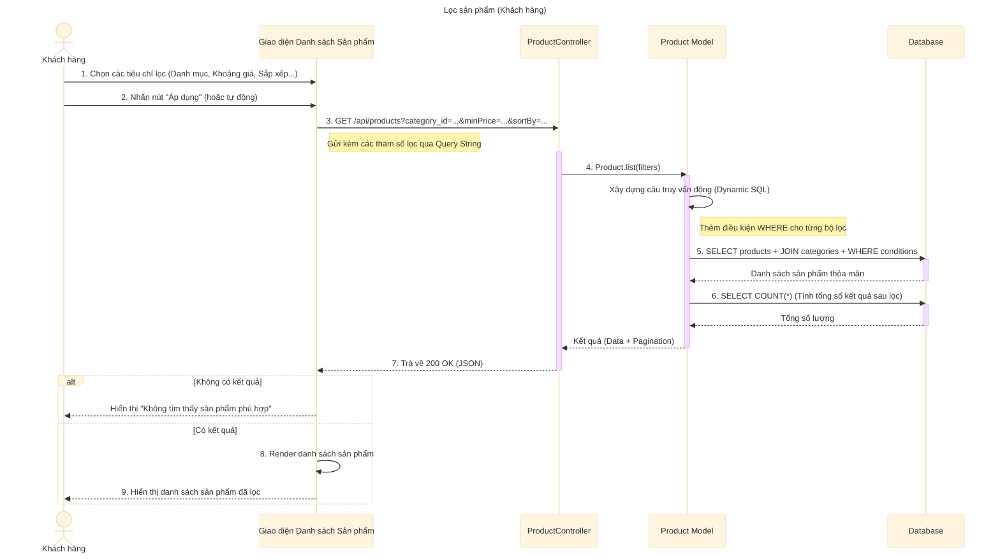

# Sơ đồ tuần tự: Lọc sản phẩm (Khách hàng)

## Mô tả chi tiết các bước

1.  **Khách hàng** thao tác trên bộ lọc của giao diện (chọn danh mục, nhập khoảng giá, chọn tiêu chí sắp xếp như "Giá tăng dần", "Mới nhất"...).
2.  **Giao diện** ghi nhận thay đổi và gửi yêu cầu `GET` đến API `/api/products`.
3.  Các tiêu chí lọc được gửi dưới dạng tham số truy vấn (Query Parameters), ví dụ: `?category_id=1&minPrice=1000000&sortOrder=ASC`.
4.  **ProductController** đóng gói các tham số này vào object `filters` và gọi hàm `Product.list`.
5.  **Product Model** kiểm tra từng tham số trong `filters`:
    *   Nếu có `category_id`, thêm điều kiện `AND category_id = ?`.
    *   Nếu có `minPrice`/`maxPrice`, thêm điều kiện so sánh giá (thường cần JOIN với bảng biến thể hoặc dùng sub-query giá).
    *   Xử lý `sortBy` và `sortOrder` để thêm mệnh đề `ORDER BY`.
6.  **Product Model** thực hiện truy vấn Database với các điều kiện đã xây dựng.
7.  **Product Model** đếm tổng số bản ghi thỏa mãn điều kiện lọc để phục vụ phân trang.
8.  **ProductController** trả về dữ liệu JSON cho Client.
9.  **Giao diện** cập nhật danh sách sản phẩm hiển thị theo kết quả trả về.
