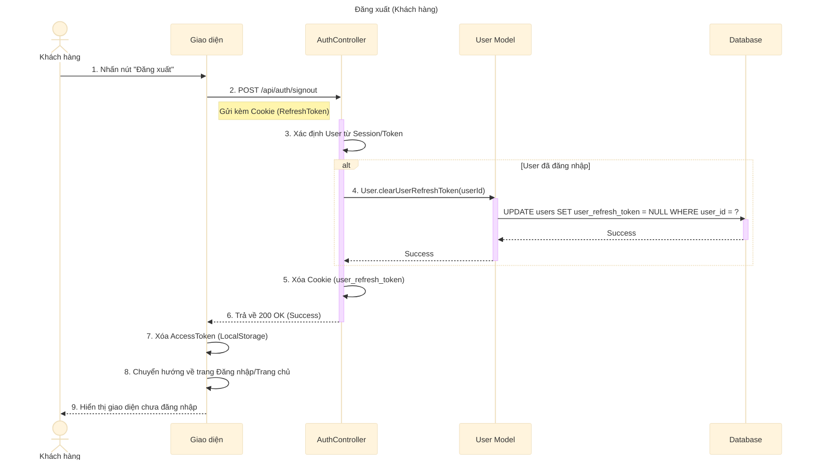

# Sơ đồ tuần tự: Đăng xuất (Khách hàng)

## Mô tả chi tiết các bước

1.  **Khách hàng** nhấn nút "Đăng xuất" trên thanh menu hoặc trang cá nhân.
2.  **Giao diện** gửi yêu cầu `POST` đến API `/api/auth/signout`.
3.  **AuthController** nhận yêu cầu, xác định người dùng dựa trên thông tin session hoặc token gửi kèm.
4.  Nếu xác định được người dùng, **AuthController** gọi **User Model** để xóa Refresh Token trong cơ sở dữ liệu.
    *   Điều này đảm bảo Token đó không thể dùng để lấy Access Token mới được nữa (thu hồi quyền truy cập).
5.  **User Model** thực hiện câu lệnh `UPDATE` để set `user_refresh_token` về `NULL`.
6.  **AuthController** xóa Cookie chứa Refresh Token ở phía Client (bằng cách set thời gian hết hạn về quá khứ).
7.  **AuthController** trả về phản hồi thành công.
8.  **Giao diện** xóa Access Token đang lưu trong LocalStorage (nếu có).
9.  **Giao diện** chuyển hướng người dùng về trang Đăng nhập hoặc Trang chủ và cập nhật trạng thái giao diện thành chưa đăng nhập.
