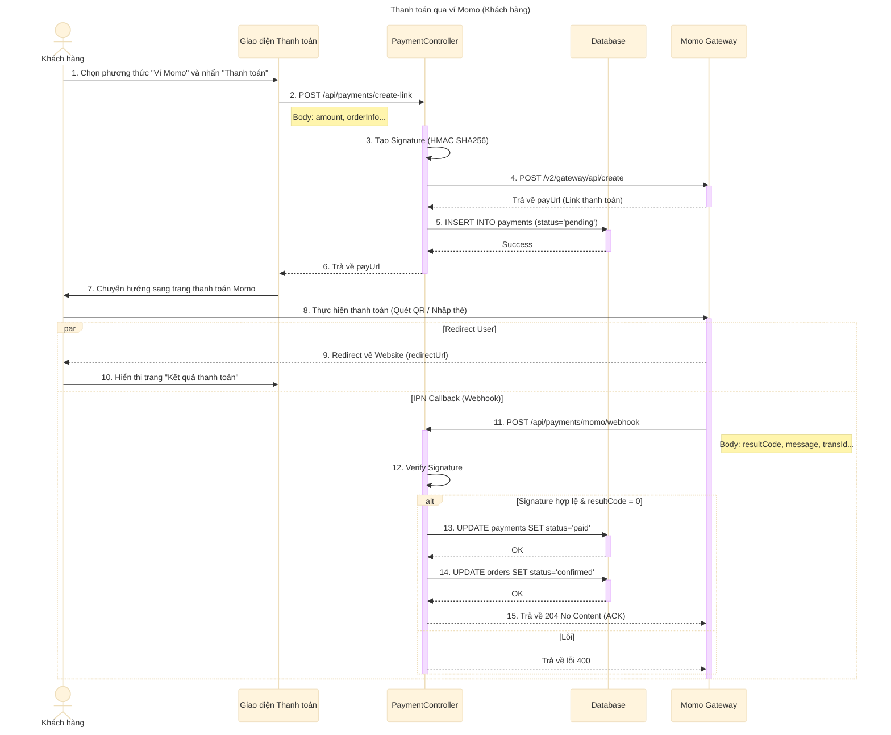

# Sơ đồ tuần tự: Thanh toán Momo (Khách hàng)

## Mô tả chi tiết các bước

1.  **Khách hàng** chọn phương thức thanh toán là "Ví Momo" tại bước thanh toán và nhấn nút xác nhận.
2.  **Giao diện** gửi yêu cầu tạo link thanh toán đến API `/api/payments/create-link`.
3.  **PaymentController** tạo chữ ký điện tử (Signature) dựa trên các thông tin đơn hàng và cấu hình bảo mật (Access Key, Secret Key).
4.  **PaymentController** gọi API của Momo để khởi tạo giao dịch.
5.  **Momo** trả về đường dẫn thanh toán (`payUrl`).
6.  **PaymentController** lưu thông tin giao dịch vào bảng `payments` với trạng thái `pending` (đang chờ).
7.  **PaymentController** trả về `payUrl` cho Client.
8.  **Giao diện** chuyển hướng người dùng sang trang thanh toán của Momo.
9.  **Khách hàng** thực hiện thanh toán trên giao diện của Momo (quét mã QR hoặc nhập thông tin thẻ).
10. Sau khi thanh toán xong:
    *   **Luồng 1 (Redirect):** Momo chuyển hướng người dùng quay lại website bán hàng (theo `redirectUrl`). Giao diện hiển thị kết quả (thành công hoặc thất bại).
    *   **Luồng 2 (IPN/Webhook):** Momo gửi một request ngầm (Server-to-Server) đến `ipnUrl` của hệ thống để thông báo kết quả chính xác.
11. **PaymentController** (Webhook) nhận thông báo từ Momo.
12. Hệ thống kiểm tra lại chữ ký (Signature) để đảm bảo dữ liệu toàn vẹn và đến từ Momo.
13. Nếu thanh toán thành công (`resultCode = 0`), hệ thống cập nhật trạng thái trong bảng `payments` thành `paid`.
14. Hệ thống cập nhật trạng thái đơn hàng trong bảng `orders` thành `confirmed` (đã xác nhận) và `payment_status` thành `paid`.
15. Hệ thống phản hồi lại cho Momo để xác nhận đã nhận được thông báo.
