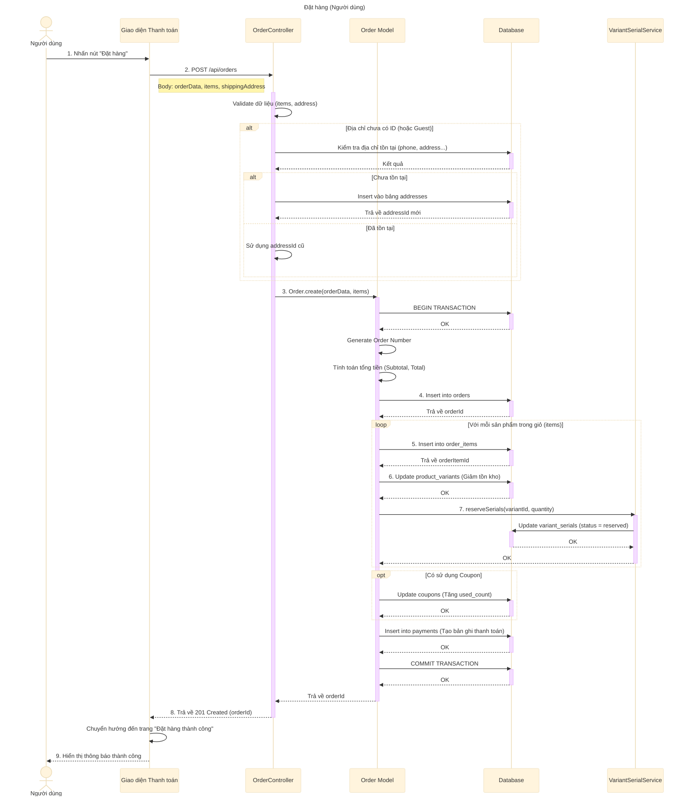

# Sơ đồ tuần tự: Đặt hàng (Người dùng)

## Mô tả chi tiết các bước

1.  **Người dùng** điền thông tin giao hàng và nhấn nút "Đặt hàng".
2.  **Giao diện** gửi yêu cầu `POST` đến API `/api/orders` kèm theo thông tin đơn hàng, danh sách sản phẩm và địa chỉ giao hàng.
3.  **OrderController** kiểm tra tính hợp lệ của dữ liệu.
    *   Nếu địa chỉ chưa có ID (khách mới hoặc địa chỉ mới), hệ thống kiểm tra xem địa chỉ này đã có trong DB chưa. Nếu chưa thì tạo mới trong bảng `addresses`.
4.  **OrderController** gọi `Order.create` để bắt đầu quy trình tạo đơn.
5.  **Order Model** bắt đầu Transaction để đảm bảo tính toàn vẹn dữ liệu.
6.  **Order Model** tạo mã đơn hàng (Order Number) và tính toán lại tổng tiền.
7.  **Order Model** lưu thông tin chính của đơn hàng vào bảng `orders`.
8.  **Order Model** lặp qua từng sản phẩm trong giỏ hàng:
    *   Lưu chi tiết vào bảng `order_items`.
    *   Trừ số lượng tồn kho trong bảng `product_variants`.
    *   Gọi `VariantSerialService` để giữ chỗ (reserve) các mã Serial (IMEI/Serial Number) cho sản phẩm đó.
9.  Nếu có mã giảm giá, cập nhật số lượt sử dụng trong bảng `coupons`.
10. Tạo bản ghi thanh toán ban đầu trong bảng `payments`.
11. **Order Model** Commit Transaction (lưu tất cả thay đổi).
12. **OrderController** trả về kết quả thành công kèm `orderId`.
13. **Giao diện** chuyển hướng người dùng đến trang thông báo đặt hàng thành công.
