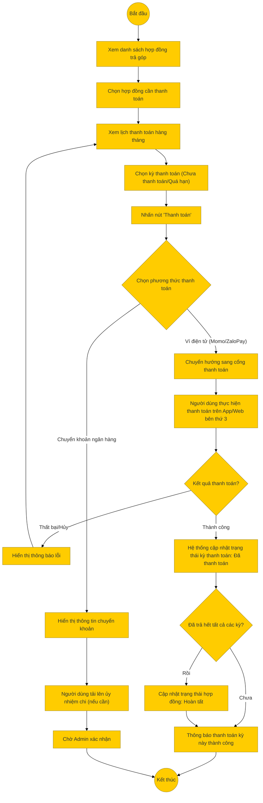

# Sơ đồ hoạt động: Thanh toán trả góp (User)

```mermaid
%%{init: {'theme': 'base', 'themeVariables': { 'primaryColor': '#ffcc00', 'edgeLabelBackground':'#ffffff', 'tertiaryColor': '#fff0f0'}}}%%
flowchart TD
    Start((Bắt đầu)) --> ViewList["Xem danh sách hợp đồng trả góp"]
    ViewList --> SelectContract["Chọn hợp đồng cần thanh toán"]
    SelectContract --> ViewSchedule["Xem lịch thanh toán hàng tháng"]
    
    ViewSchedule --> SelectPayment["Chọn kỳ thanh toán (Chưa thanh toán/Quá hạn)"]
    SelectPayment --> ClickPay["Nhấn nút 'Thanh toán'"]
    
    ClickPay --> ChooseMethod{"Chọn phương thức thanh toán"}
    ChooseMethod -- "Ví điện tử (Momo/ZaloPay)" --> RedirectGateway["Chuyển hướng sang cổng thanh toán"]
    ChooseMethod -- "Chuyển khoản ngân hàng" --> ShowBankInfo["Hiển thị thông tin chuyển khoản"]
    
    RedirectGateway --> ProcessPayment["Người dùng thực hiện thanh toán trên App/Web bên thứ 3"]
    ProcessPayment --> ReturnResult{"Kết quả thanh toán?"}
    
    ReturnResult -- "Thất bại/Hủy" --> ShowError["Hiển thị thông báo lỗi"]
    ShowError --> ViewSchedule
    
    ReturnResult -- "Thành công" --> UpdateStatus["Hệ thống cập nhật trạng thái kỳ thanh toán: Đã thanh toán"]
    UpdateStatus --> CheckFinish{"Đã trả hết tất cả các kỳ?"}
    
    CheckFinish -- "Chưa" --> NotifySuccess["Thông báo thanh toán kỳ này thành công"]
    CheckFinish -- "Rồi" --> UpdateContract["Cập nhật trạng thái hợp đồng: Hoàn tất"]
    UpdateContract --> NotifySuccess
    
    NotifySuccess --> End((Kết thúc))
    
    ShowBankInfo --> UploadProof["Người dùng tải lên ủy nhiệm chi (nếu cần)"]
    UploadProof --> WaitAdmin["Chờ Admin xác nhận"]
    WaitAdmin --> End 
```