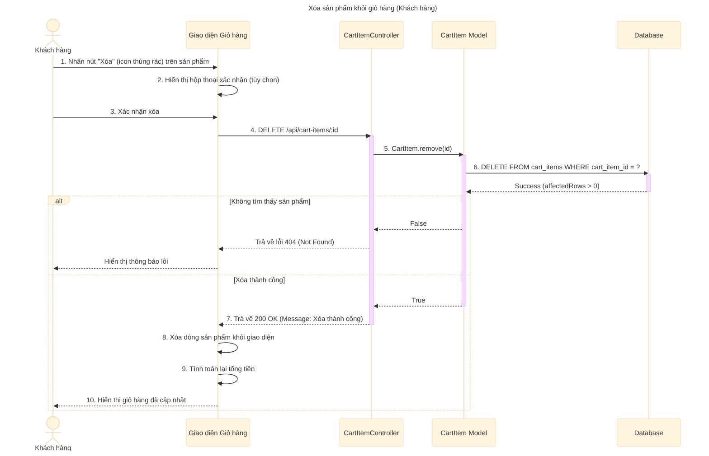

# Sơ đồ tuần tự: Xóa sản phẩm khỏi giỏ hàng (Khách hàng)

## Mô tả chi tiết các bước

1.  **Khách hàng** nhấn vào biểu tượng xóa (thùng rác) tương ứng với sản phẩm muốn loại bỏ khỏi giỏ hàng.
2.  **Giao diện** có thể hiển thị hộp thoại xác nhận để tránh thao tác nhầm.
3.  **Khách hàng** xác nhận hành động xóa.
4.  **Giao diện** gửi yêu cầu `DELETE` đến API `/api/cart-items/:id` (với `id` là `cart_item_id`).
5.  **CartItemController** gọi hàm `CartItem.remove` trong Model.
6.  **CartItem Model** thực hiện câu lệnh `DELETE` trực tiếp vào bảng `cart_items` trong cơ sở dữ liệu.
7.  **Database** trả về kết quả (số dòng bị ảnh hưởng).
8.  **CartItemController** kiểm tra kết quả:
    *   Nếu không có dòng nào bị xóa (không tìm thấy ID), trả về lỗi 404.
    *   Nếu xóa thành công, trả về thông báo thành công (200 OK).
9.  **Giao diện** loại bỏ sản phẩm đó khỏi danh sách hiển thị, tính toán lại tổng tiền của giỏ hàng và cập nhật giao diện cho người dùng.
