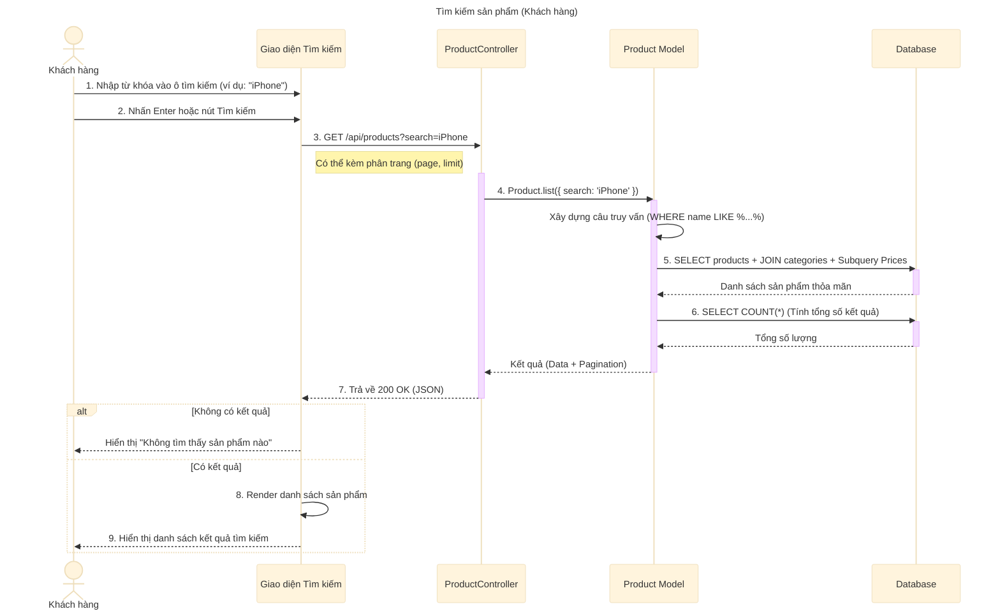

# Sơ đồ tuần tự: Tìm kiếm sản phẩm (Khách hàng)

## Mô tả chi tiết các bước

1.  **Khách hàng** nhập từ khóa (tên sản phẩm, mã sản phẩm...) vào thanh tìm kiếm trên giao diện.
2.  **Khách hàng** kích hoạt hành động tìm kiếm (nhấn Enter hoặc click icon kính lúp).
3.  **Giao diện** gửi yêu cầu `GET` đến API `/api/products` với tham số `search`.
4.  **ProductController** nhận yêu cầu và gọi hàm `Product.list` trong Model.
5.  **Product Model** xây dựng câu lệnh SQL động:
    *   Thêm điều kiện `WHERE (product_name LIKE ? OR slug LIKE ?)` để tìm kiếm tương đối.
    *   Thực hiện các sub-query để lấy giá thấp nhất/cao nhất của các biến thể (`min_variant_price`, `max_variant_price`).
6.  **Product Model** thực hiện truy vấn chính để lấy danh sách sản phẩm.
7.  **Product Model** thực hiện truy vấn phụ để đếm tổng số kết quả (phục vụ phân trang).
8.  **ProductController** trả về kết quả dưới dạng JSON bao gồm danh sách sản phẩm và thông tin phân trang.
9.  **Giao diện** hiển thị kết quả cho người dùng. Nếu không có kết quả, hiển thị thông báo phù hợp.
