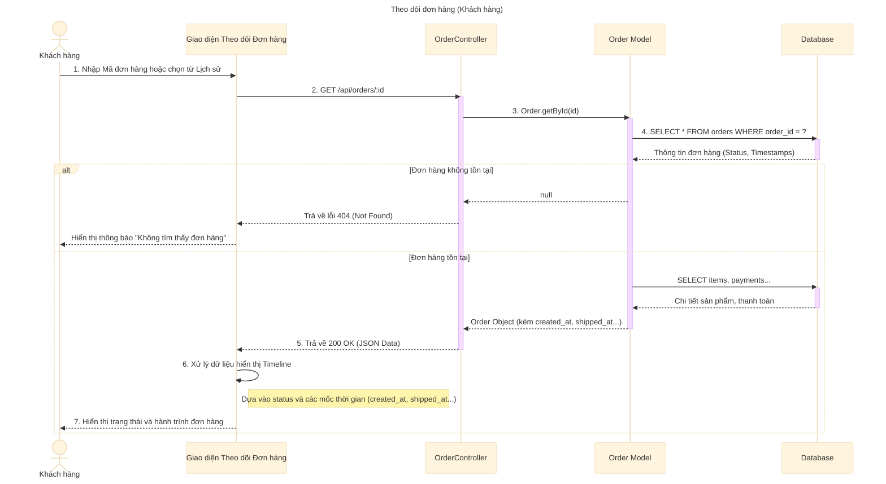

# Sơ đồ tuần tự: Theo dõi đơn hàng (Khách hàng)

## Mô tả chi tiết các bước

1.  **Khách hàng** truy cập trang "Tra cứu đơn hàng" và nhập mã đơn hàng, hoặc nhấn vào nút "Theo dõi" từ danh sách lịch sử đơn hàng.
2.  **Giao diện** gửi yêu cầu `GET` đến API `/api/orders/:id` để lấy thông tin chi tiết.
3.  **OrderController** gọi hàm `Order.getById` trong Model.
4.  **Order Model** truy vấn Database để lấy thông tin đơn hàng, đặc biệt là các trường trạng thái (`order_status`) và thời gian (`created_at`, `confirmed_at`, `shipped_at`, `delivered_at`, `cancelled_at`).
5.  **Order Model** lấy thêm thông tin sản phẩm và thanh toán liên quan.
6.  **OrderController** trả về dữ liệu JSON cho Client.
7.  **Giao diện** dựa vào dữ liệu nhận được để xây dựng Timeline (Dòng thời gian):
    *   Nếu có `created_at`: Đã đặt hàng.
    *   Nếu có `confirmed_at`: Đã xác nhận.
    *   Nếu có `shipped_at`: Đang giao hàng.
    *   Nếu có `delivered_at`: Giao hàng thành công.
    *   Nếu trạng thái là `cancelled`: Hiển thị Đã hủy.
8.  **Khách hàng** xem được đơn hàng của mình đang ở giai đoạn nào.
