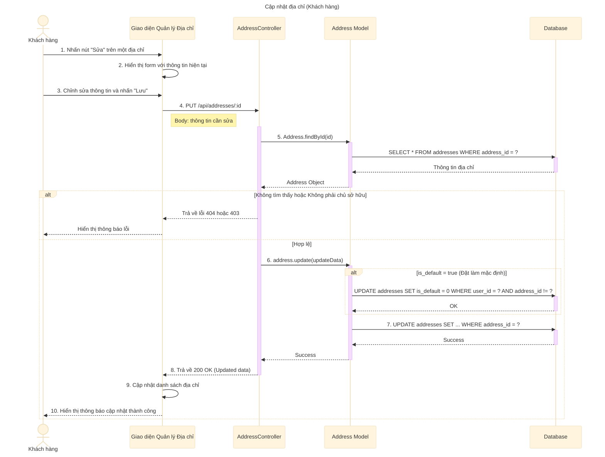

# Sơ đồ tuần tự: Cập nhật địa chỉ (Khách hàng)

## Mô tả chi tiết các bước

1.  **Khách hàng** nhấn nút "Sửa" tại dòng địa chỉ muốn thay đổi.
2.  **Giao diện** hiển thị form nhập liệu với các thông tin cũ đã được điền sẵn.
3.  **Khách hàng** thay đổi thông tin (ví dụ: số điện thoại, địa chỉ chi tiết...) và nhấn "Lưu".
4.  **Giao diện** gửi yêu cầu `PUT` đến API `/api/addresses/:id` với dữ liệu mới.
5.  **AddressController** gọi `Address.findById` để lấy thông tin địa chỉ hiện tại từ Database.
    *   Hệ thống kiểm tra xem địa chỉ có tồn tại không và người đang sửa có phải là chủ sở hữu (`user_id` khớp nhau) hay không.
6.  Nếu hợp lệ, **AddressController** gọi phương thức `update` của đối tượng Address.
7.  **Address Model** xử lý logic nghiệp vụ:
    *   Nếu người dùng chọn "Đặt làm mặc định" (`is_default = true`), hệ thống sẽ chạy câu lệnh `UPDATE` để bỏ trạng thái mặc định của tất cả các địa chỉ khác của người dùng này.
8.  **Address Model** thực hiện câu lệnh `UPDATE` chính để lưu thông tin mới vào bảng `addresses`.
9.  **AddressController** trả về phản hồi thành công kèm dữ liệu đã cập nhật.
10. **Giao diện** cập nhật lại thông tin hiển thị và thông báo thành công cho người dùng.
