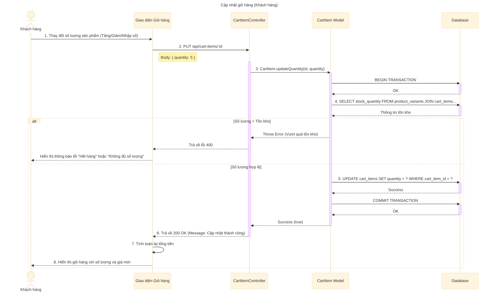

# Sơ đồ tuần tự: Cập nhật giỏ hàng (Khách hàng)

## Mô tả chi tiết các bước

1.  **Khách hàng** thay đổi số lượng của một sản phẩm trong giỏ hàng (nhấn nút cộng/trừ hoặc nhập số trực tiếp).
2.  **Giao diện** gửi yêu cầu `PUT` đến API `/api/cart-items/:id` với số lượng mới.
3.  **CartItemController** nhận yêu cầu và gọi hàm `CartItem.updateQuantity`.
4.  **CartItem Model** bắt đầu Transaction.
5.  **CartItem Model** truy vấn Database để lấy thông tin tồn kho hiện tại của sản phẩm (`stock_quantity`).
6.  Hệ thống kiểm tra:
    *   Nếu số lượng yêu cầu lớn hơn số lượng tồn kho: Báo lỗi và Rollback (nếu cần).
    *   Nếu hợp lệ: Thực hiện cập nhật.
7.  **CartItem Model** thực hiện câu lệnh `UPDATE` để thay đổi số lượng trong bảng `cart_items`.
8.  **CartItem Model** Commit Transaction.
9.  **CartItemController** trả về phản hồi thành công.
10. **Giao diện** cập nhật lại hiển thị (số lượng, thành tiền của món hàng, tổng tiền giỏ hàng).
