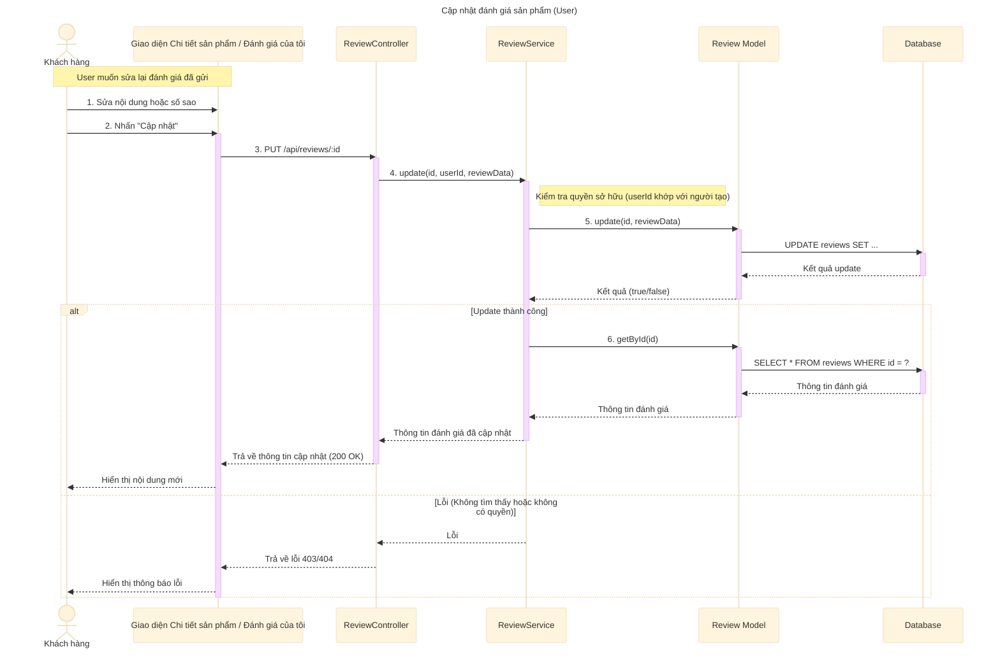

# Sơ đồ tuần tự: Cập nhật đánh giá sản phẩm (User)

```mermaid
%%{init: {'theme': 'base', 'themeVariables': { 'loopBorder': '#000000'}}}%%
sequenceDiagram
    title: Cập nhật đánh giá sản phẩm (User)
    actor User as Khách hàng
    participant UI as Giao diện Chi tiết sản phẩm / Đánh giá của tôi
    participant Controller as ReviewController
    participant Service as ReviewService
    participant Model as Review Model
    participant DB as Database

    note over User, UI: User muốn sửa lại đánh giá đã gửi

    User->>UI: 1. Sửa nội dung hoặc số sao
    User->>UI: 2. Nhấn "Cập nhật"
    
    activate UI
    UI->>Controller: 3. PUT /api/reviews/:id
    activate Controller
    
    Controller->>Service: 4. update(id, userId, reviewData)
    activate Service
    
    note right of Service: Kiểm tra quyền sở hữu (userId khớp với người tạo)
    
    Service->>Model: 5. update(id, reviewData)
    activate Model
    Model->>DB: UPDATE reviews SET ...
    activate DB
    DB-->>Model: Kết quả update
    deactivate DB
    Model-->>Service: Kết quả (true/false)
    deactivate Model
    
    alt Update thành công
        Service->>Model: 6. getById(id)
        activate Model
        Model->>DB: SELECT * FROM reviews WHERE id = ?
        activate DB
        DB-->>Model: Thông tin đánh giá
        deactivate DB
        Model-->>Service: Thông tin đánh giá
        deactivate Model
        
        Service-->>Controller: Thông tin đánh giá đã cập nhật
        deactivate Service
        
        Controller-->>UI: Trả về thông tin cập nhật (200 OK)
        deactivate Controller
        
        UI-->>User: Hiển thị nội dung mới
    else Lỗi (Không tìm thấy hoặc không có quyền)
        Service-->>Controller: Lỗi
        Controller-->>UI: Trả về lỗi 403/404
        UI-->>User: Hiển thị thông báo lỗi
    end
    deactivate UI
```