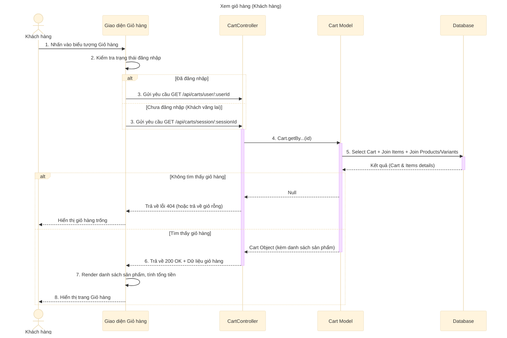

# Sơ đồ tuần tự: Xem giỏ hàng (Khách hàng)

## Mô tả chi tiết các bước

1.  **Khách hàng** nhấn vào biểu tượng giỏ hàng trên header hoặc menu.
2.  **Giao diện** kiểm tra xem người dùng đã đăng nhập chưa.
    *   Nếu đã đăng nhập: Sử dụng `userId` để lấy giỏ hàng.
    *   Nếu chưa đăng nhập: Sử dụng `sessionId` (lưu trong Cookie/LocalStorage) để lấy giỏ hàng.
3.  **Giao diện** gửi request `GET` đến API tương ứng (ví dụ: `/api/carts/user/:userId` hoặc `/api/carts/session/:sessionId`).
4.  **CartController** gọi **Cart Model** để lấy thông tin giỏ hàng.
5.  **Cart Model** truy vấn Database, thực hiện các phép `JOIN` để lấy chi tiết:
    *   Thông tin giỏ hàng.
    *   Danh sách sản phẩm trong giỏ (`cart_items`).
    *   Chi tiết biến thể (`variants`) và sản phẩm (`products`) như tên, giá, hình ảnh.
6.  **CartController** trả về kết quả cho Client.
7.  **Giao diện** nhận dữ liệu, tính toán lại tổng tiền (nếu cần hiển thị phía client) và render danh sách sản phẩm.
8.  **Khách hàng** nhìn thấy danh sách các sản phẩm đã chọn mua.
