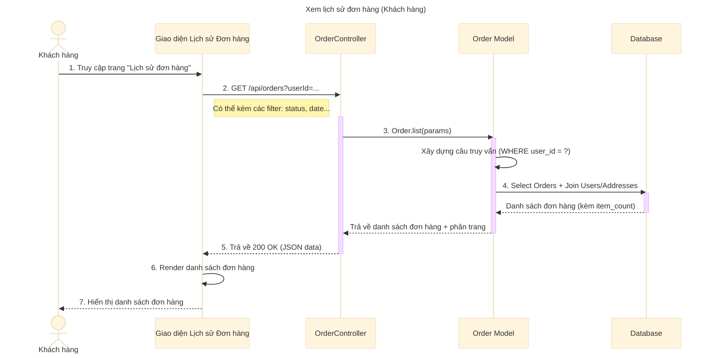

# Sơ đồ tuần tự: Xem lịch sử đơn hàng (Khách hàng)

## Mô tả chi tiết các bước

1.  **Khách hàng** truy cập vào mục "Lịch sử đơn hàng" hoặc "Đơn hàng của tôi" trên giao diện web/app.
2.  **Giao diện** gửi yêu cầu `GET` đến API `/api/orders` với tham số `userId` của người dùng hiện tại.
    *   Có thể kèm theo các tham số lọc khác như `page` (trang), `limit` (số lượng), `orderStatus` (trạng thái đơn), `fromDate`, `toDate`.
3.  **OrderController** nhận yêu cầu và gọi hàm `Order.list` với các tham số đã nhận.
4.  **Order Model** xây dựng câu lệnh SQL động dựa trên các điều kiện lọc (đặc biệt là `user_id`).
5.  **Order Model** thực hiện truy vấn Database để lấy danh sách đơn hàng.
    *   Truy vấn này thường `JOIN` với bảng `users` và `addresses` để lấy thông tin hiển thị cơ bản.
    *   Thường có sub-query để đếm số lượng sản phẩm (`item_count`) hoặc kiểm tra trả góp (`is_installment`).
6.  **Database** trả về kết quả truy vấn.
7.  **OrderController** trả về dữ liệu JSON cho Client, bao gồm danh sách đơn hàng và thông tin phân trang (tổng số trang, trang hiện tại).
8.  **Giao diện** hiển thị danh sách các đơn hàng cho người dùng xem.
