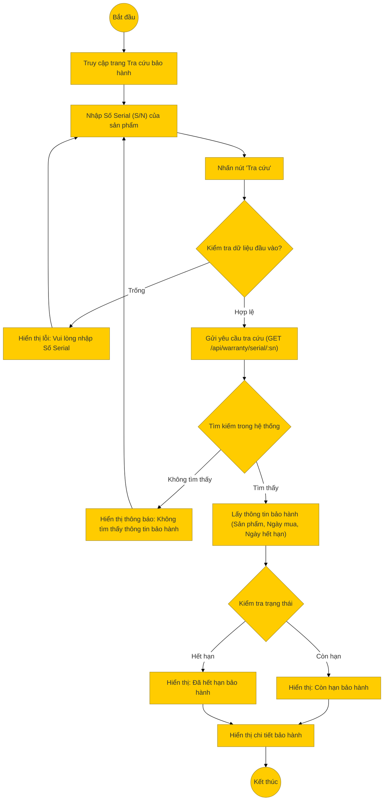

```mermaid
%%{init: {'theme': 'base', 'themeVariables': { 'primaryColor': '#ffcc00', 'edgeLabelBackground':'#ffffff', 'tertiaryColor': '#fff0f0'}}}%%
flowchart TD
    Start((Bắt đầu)) --> AccessPage["Truy cập trang Tra cứu bảo hành"]
    AccessPage --> InputSerial["Nhập Số Serial (S/N) của sản phẩm"]
    InputSerial --> ClickSearch["Nhấn nút 'Tra cứu'"]
    
    ClickSearch --> ValidateInput{"Kiểm tra dữ liệu đầu vào?"}
    ValidateInput -- "Trống" --> ShowInputError["Hiển thị lỗi: Vui lòng nhập Số Serial"]
    ShowInputError --> InputSerial
    
    ValidateInput -- "Hợp lệ" --> CallAPI["Gửi yêu cầu tra cứu (GET /api/warranty/serial/:sn)"]
    
    CallAPI --> CheckDB{"Tìm kiếm trong hệ thống"}
    CheckDB -- "Không tìm thấy" --> ShowNotFound["Hiển thị thông báo: Không tìm thấy thông tin bảo hành"]
    ShowNotFound --> InputSerial
    
    CheckDB -- "Tìm thấy" --> GetInfo["Lấy thông tin bảo hành (Sản phẩm, Ngày mua, Ngày hết hạn)"]
    GetInfo --> CheckStatus{"Kiểm tra trạng thái"}
    
    CheckStatus -- "Còn hạn" --> DisplayActive["Hiển thị: Còn hạn bảo hành"]
    CheckStatus -- "Hết hạn" --> DisplayExpired["Hiển thị: Đã hết hạn bảo hành"]
    
    DisplayActive --> ShowDetails["Hiển thị chi tiết bảo hành"]
    DisplayExpired --> ShowDetails
    
    ShowDetails --> End((Kết thúc))
```