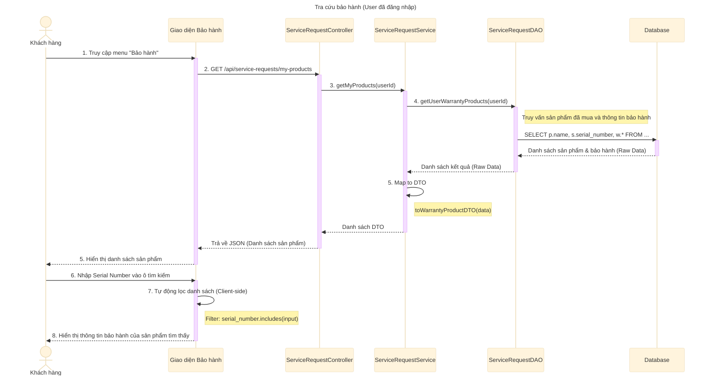

# Sơ đồ tuần tự: Tra cứu bảo hành (User đã đăng nhập)

```mermaid
%%{init: {'theme': 'base', 'themeVariables': { 'loopBorder': '#000000'}}}%%
sequenceDiagram
    title: Tra cứu bảo hành (User đã đăng nhập)
    actor User as Khách hàng
    participant UI as Giao diện Bảo hành
    participant Controller as ServiceRequestController
    participant Service as ServiceRequestService
    participant DAO as ServiceRequestDAO
    participant DB as Database

    User->>UI: 1. Truy cập menu "Bảo hành"
    activate UI
    
    UI->>Controller: 2. GET /api/service-requests/my-products
    activate Controller
    
    Controller->>Service: 3. getMyProducts(userId)
    activate Service
    
    Service->>DAO: 4. getUserWarrantyProducts(userId)
    activate DAO
    note right of DAO: Truy vấn sản phẩm đã mua và thông tin bảo hành
    DAO->>DB: SELECT p.name, s.serial_number, w.* FROM ...
    activate DB
    DB-->>DAO: Danh sách sản phẩm & bảo hành (Raw Data)
    deactivate DB
    DAO-->>Service: Danh sách kết quả (Raw Data)
    deactivate DAO
    
    Service->>Service: 5. Map to DTO
    note right of Service: toWarrantyProductDTO(data)

    Service-->>Controller: Danh sách DTO
    deactivate Service
    
    Controller-->>UI: Trả về JSON (Danh sách sản phẩm)
    deactivate Controller
    
    UI-->>User: 5. Hiển thị danh sách sản phẩm
    deactivate UI

    User->>UI: 6. Nhập Serial Number vào ô tìm kiếm
    activate UI
    UI->>UI: 7. Tự động lọc danh sách (Client-side)
    note right of UI: Filter: serial_number.includes(input)
    UI-->>User: 8. Hiển thị thông tin bảo hành của sản phẩm tìm thấy
    deactivate UI
```
