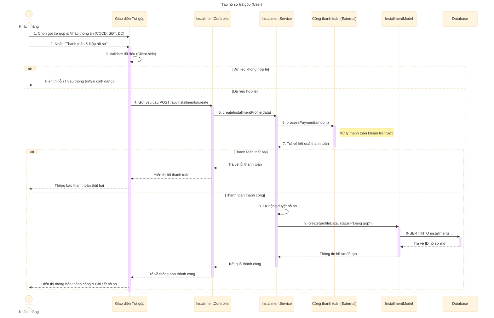

# Sơ đồ tuần tự: Tạo hồ sơ trả góp (User)

```mermaid
%%{init: {'theme': 'base', 'themeVariables': { 'loopBorder': '#000000'}}}%%
sequenceDiagram
    title: Tạo hồ sơ trả góp (User)
    actor User as Khách hàng
    participant UI as Giao diện Trả góp
    participant Controller as InstallmentController
    participant Service as InstallmentService
    participant Payment as Cổng thanh toán (External)
    participant Model as InstallmentModel
    participant DB as Database

    User->>UI: 1. Chọn gói trả góp & Nhập thông tin (CCCD, SĐT, ĐC)
    User->>UI: 2. Nhấn "Thanh toán & Nộp hồ sơ"
    
    activate UI
    UI->>UI: 3. Validate dữ liệu (Client-side)
    
    alt Dữ liệu không hợp lệ
        UI-->>User: Hiển thị lỗi (Thiếu thông tin/Sai định dạng)
    else Dữ liệu hợp lệ
        UI->>Controller: 4. Gửi yêu cầu POST /api/installments/create
        activate Controller
        
        Controller->>Service: 5. createInstallmentProfile(data)
        activate Service
        
        Service->>Payment: 6. processPayment(amount)
        activate Payment
        note right of Payment: Xử lý thanh toán khoản trả trước
        Payment-->>Service: 7. Trả về kết quả thanh toán
        deactivate Payment
        
        alt Thanh toán thất bại
            Service-->>Controller: Trả về lỗi thanh toán
            Controller-->>UI: Hiển thị lỗi thanh toán
            UI-->>User: Thông báo thanh toán thất bại
        else Thanh toán thành công
            Service->>Service: 8. Tự động duyệt hồ sơ
            Service->>Model: 9. create(profileData, status="Đang góp")
            activate Model
            Model->>DB: INSERT INTO installments ...
            activate DB
            DB-->>Model: Trả về ID hồ sơ mới
            deactivate DB
            Model-->>Service: Thông tin hồ sơ đã tạo
            deactivate Model
            
            Service-->>Controller: Kết quả thành công
            deactivate Service
            
            Controller-->>UI: Trả về thông báo thành công
            deactivate Controller
            
            UI-->>User: Hiển thị thông báo thành công & Chi tiết hồ sơ
        end
    end
    deactivate UI
```
