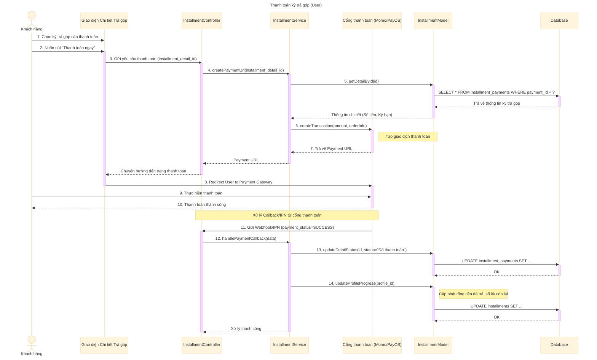

# Sơ đồ tuần tự: Thanh toán kỳ trả góp (User)

```mermaid
%%{init: {'theme': 'base', 'themeVariables': { 'loopBorder': '#000000'}}}%%
sequenceDiagram
    title: Thanh toán kỳ trả góp (User)
    actor User as Khách hàng
    participant UI as Giao diện Chi tiết Trả góp
    participant Controller as InstallmentController
    participant Service as InstallmentService
    participant Payment as Cổng thanh toán (Momo/PayOS)
    participant Model as InstallmentModel
    participant DB as Database

    User->>UI: 1. Chọn kỳ trả góp cần thanh toán
    User->>UI: 2. Nhấn nút "Thanh toán ngay"
    
    activate UI
    UI->>Controller: 3. Gửi yêu cầu thanh toán (installment_detail_id)
    activate Controller
    
    Controller->>Service: 4. createPaymentUrl(installment_detail_id)
    activate Service
    
    Service->>Model: 5. getDetailById(id)
    activate Model
    Model->>DB: SELECT * FROM installment_payments WHERE payment_id = ?
    activate DB
    DB-->>Model: Trả về thông tin kỳ trả góp
    deactivate DB
    Model-->>Service: Thông tin chi tiết (Số tiền, Kỳ hạn)
    deactivate Model
    
    Service->>Payment: 6. createTransaction(amount, orderInfo)
    activate Payment
    note right of Payment: Tạo giao dịch thanh toán
    Payment-->>Service: 7. Trả về Payment URL
    deactivate Payment
    
    Service-->>Controller: Payment URL
    deactivate Service
    
    Controller-->>UI: Chuyển hướng đến trang thanh toán
    deactivate Controller
    
    UI->>Payment: 8. Redirect User to Payment Gateway
    deactivate UI
    
    activate Payment
    User->>Payment: 9. Thực hiện thanh toán
    Payment-->>User: 10. Thanh toán thành công
    deactivate Payment

    note over Payment, Controller: Xử lý Callback/IPN từ cổng thanh toán
    
    Payment->>Controller: 11. Gửi Webhook/IPN (payment_status=SUCCESS)
    activate Controller
    
    Controller->>Service: 12. handlePaymentCallback(data)
    activate Service
    
    Service->>Model: 13. updateDetailStatus(id, status="Đã thanh toán")
    activate Model
    Model->>DB: UPDATE installment_payments SET ...
    activate DB
    DB-->>Model: OK
    deactivate DB
    deactivate Model
    
    Service->>Model: 14. updateProfileProgress(profile_id)
    activate Model
    note right of Model: Cập nhật tổng tiền đã trả, số kỳ còn lại
    Model->>DB: UPDATE installments SET ...
    activate DB
    DB-->>Model: OK
    deactivate DB
    deactivate Model
    
    Service-->>Controller: Xử lý thành công
    deactivate Service
    deactivate Controller
```
